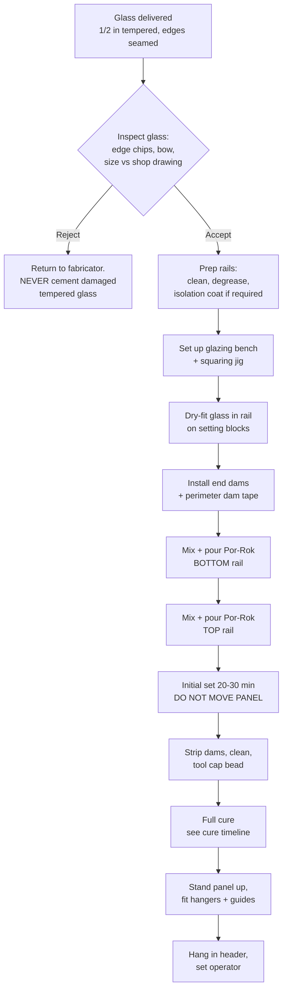

# 01 — System Overview

## What the TX9500 is

The TORMAX TX9500 is an all-glass automatic sliding entrance series driven by
the iMotion direct-drive operator (2301 / 2401). The sliding panels are **1/2"
(12 mm) tempered glass**, available in concealed or surface-mount header
configurations, with sliding-panel-only or full breakout for emergency egress.

"All-glass" means the panel has **no vertical stiles**. The entire panel is a
single tempered lite captured only at the top and bottom by aluminum rails. In
this trade the rail is commonly called the **shoe**.

---

## Diagram 1.1 — Panel exploded view

```
                        ═══════════════════════════════
                             HEADER / TRACK
                        ═══════════════════════════════
                          ║                       ║
                       ┌──╨──┐                 ┌──╨──┐
                       │ HGR │                 │ HGR │   ← hangers / carriers
                       └──┬──┘                 └──┬──┘     (bolt into top rail)
                          │                       │
     ┌────────────────────┴───────────────────────┴────────────────────┐
     │                        TOP RAIL  (shoe)                          │
     └──────────────────────────────────────────────────────────────────┘
     ╔══════════════════════════════════════════════════════════════════╗
     ║                                                                  ║
     ║                                                                  ║
     ║                  1/2" (12 mm) TEMPERED GLASS                     ║
     ║                        single monolithic lite                    ║
     ║                        no vertical stiles                        ║
     ║                                                                  ║
     ║                                                                  ║
     ╚══════════════════════════════════════════════════════════════════╝
     ┌──────────────────────────────────────────────────────────────────┐
     │                       BOTTOM RAIL  (shoe)                        │
     └──────────────────┬───────────────────────────┬───────────────────┘
                        │                           │
                     ┌──┴──┐                     ┌──┴──┐
                     │GUIDE│                     │GUIDE│   ← floor guide /
                     └─────┘                     └─────┘     anti-riser
     ─────────────────────────────────────────────────────────────────────
                          FINISH FLOOR / THRESHOLD
```

---

## The critical difference: this is a slider, not a swing door

This is the single most important thing to understand before glazing a TX9500
panel, and it is where crews carrying over habits from swing-door rails get into
trouble.

On a **swing door**, the bottom rail sits *under* the glass. The glass rests on
setting blocks and gravity holds it there. The cement mostly stabilizes and
seals; if the bond were poor, the glass would still sit in the rail.

On a **sliding panel**, the whole panel hangs from the **top rail**. The entire
panel weight is transferred from the glass, through the cement, into the top
rail, and up through the hanger bolts. **The cemented joint in the top rail is a
structural, tension-critical connection.** A bad top-rail pour does not sag — it
releases, and a 1/2" tempered lite drops out of the header.

### Diagram 1.2 — Load path comparison

```
        SWING DOOR (bottom rail)              SLIDING PANEL (top rail)
        ─────────────────────────             ─────────────────────────

              ╔═══════╗                          ┌──────┬──────┐
              ║ GLASS ║                          │  ▲   │  ▲   │  hanger bolts
              ║       ║                          └──┼───┴───┼──┘  carry ALL load
              ║       ║   weight                ┌───┼───────┼───┐
              ║       ║     │                   │ ▓▓│▓▓▓▓▓▓▓│▓▓ │ cement in
              ╚═══╤═══╝     ▼                   │ ▓▓└───┬───┘▓▓ │ TENSION +
          ┌───────┴───────┐                     │ ▓▓▓▓▓▓│▓▓▓▓▓▓ │ SHEAR
          │ ▓▓▓▓ ┌───┐ ▓▓ │  cement in          └───────┼───────┘
          │ ▓▓▓▓ │BLK│ ▓▓ │  COMPRESSION            ╔═══╧═══╗
          └──────┴───┴────┘  (block carries)        ║       ║
        ══════════════════                          ║ GLASS ║  weight
             cement fails →                         ║       ║    │
             glass still sits                       ║       ║    ▼
             in the rail                            ╚═══════╝
                                                 cement fails →
                                                 PANEL FALLS
```

**Consequence for this procedure:** the top rail pour gets the same care,
inspection, and cure time as the bottom rail — arguably more. Do not treat it as
the "easy" one because it is out of sight.

---

## Diagram 1.3 — Where the shoe fits in the assembly sequence



---

## Panel variables — fill these in from the shop drawing

Every dimension in this package refers back to this table. **Do not proceed with
blanks.** [VERIFY] all of them against the TORMAX shop drawing for this job.

| Symbol | Description | Value for this job | Typical (industry, *not* TORMAX spec) |
|---|---|---|---|
| `Tg` | Glass thickness | ______ | 1/2" (12 mm) — published for TX9500 |
| `Hr_top` | Top rail height (outside face) | ______ | 3-1/2" to 10" depending on style |
| `Hr_bot` | Bottom rail height (outside face) | ______ | 3-1/2" to 10" |
| `Wr` | Rail width (outside face) | ______ | ~1-3/4" for wet-set door rails |
| `Wc` | Rail **internal channel** width | ______ | `Wr` less two wall thicknesses |
| `B` | Glass bite — depth glass enters rail | ______ | rail height less 1/2"–3/4" |
| `Sb` | Setting block thickness (= cement below glass edge) | ______ | 1/4" |
| `Cs` | Side cement gap, each side = `(Wc − Tg) / 2` | ______ | 1/4"–5/16" |
| `Lg` | Glass width | ______ | per opening |
| `Wp` | Finished panel weight | ______ | needed for hanger + operator setup |

### Diagram 1.4 — Where each symbol lives

```
                    │◄───────────── Wr ─────────────►│
                    │                                │
                    │   │◄────────  Wc  ────────►│   │
                    │   │                        │   │
                    ├───┼────────────────────────┼───┤  ── top of rail
              ▲     │   │◄Cs►│◄─ Tg ─►│◄Cs►│     │   │
              │     │   │    ║        ║    │     │   │
              │     │   │    ║        ║    │     │   │
         Hr   │     │   │    ║ GLASS  ║    │     │   │
              │     │   │    ║        ║    │     │   │
              │     │   │    ╚════════╝    │     │   │  ── glass edge
              │  ▲  │   │                  │     │   │      ▲
              │  Sb │   │     [ BLOCK ]    │     │   │      │  B = bite
              ▼  ▼  └───┴──────────────────┴─────┴───┘  ── rail floor
```

> `B` is measured from the **top of the rail** to the **glass edge**, and
> `Hr = B + Sb + rail floor thickness`. If you measure bite from the rail floor
> instead you will over-insert the glass and lose your cement bed under the edge.

---

## Sources

- [TORMAX USA — TX9500 w/iMotion](https://www.tormaxusa.com/en/27/tx9500-w-imotion) — all-glass sliding series, 1/2" tempered glass, direct drive, concealed/surface mount, breakout options
- [TORMAX USA — Sliding Doors](https://www.tormaxusa.com/en/15/sliding-doors)
- [ARCAT — Automatic Sliding Door TX9500 w/iMotion 2401](https://www.arcat.com/product/139144)
- [Sweets — TX9500 Series w/iMotion 2401 Sliding Door System](https://sweets.construction.com/Manufacturer/TORMAX-USA-Inc-NST20185/Products/TX9500-Series-w-iMotion-2401-Sliding-Door-System-NST677046-P)
- [TORMAX TX9200/TX9500 Installation & Service Manual (PDF)](https://d3eu1jnerk19h.cloudfront.net/documents/products/TX9200-TX9500-TCP-Slide-Manual-V-2-11-2-09.pdf) — *not retrievable from this machine; retrieve and reconcile*
- [Architectural Glass & Metal — Glass Door Rails, wet-set](https://www.architecturalglassandmetal.com/glass-door-rails/) — rail height range 3-5/16" to 10", 1-3/4" wide
- [PRL Glass — All Glass Entrance Doors](https://prlglass.com/all-glass-entrance-door/) — wet-set rails for 3/8", 1/2", 5/8", 3/4" tempered
