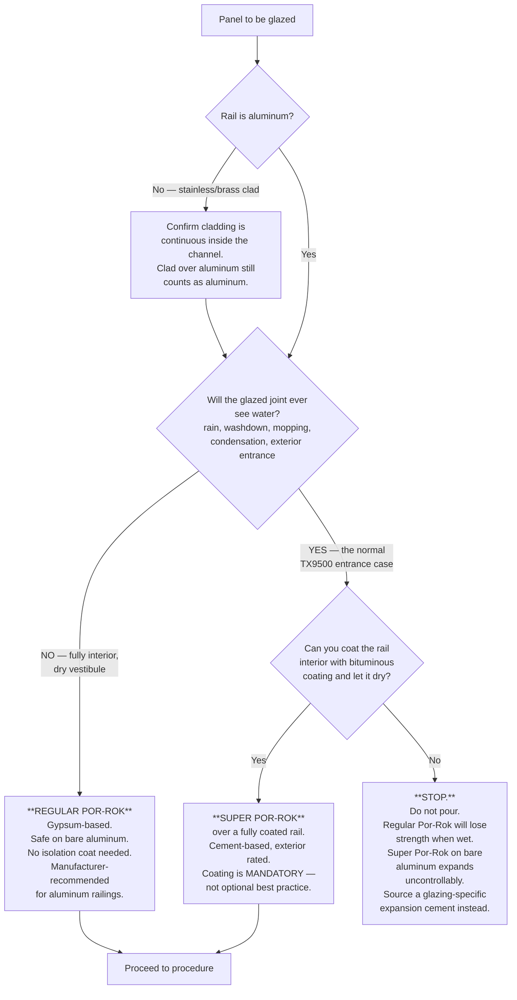

# 02 — Material Selection

## 2.1 The cement — which Por-Rok, and when

Por-Rok is sold in two formulations that look similar on the shelf and behave
very differently in an aluminum door rail. **Read the bucket, not the habit.**

### Diagram 2.1 — Por-Rok selection decision tree



### Why each restriction exists

**Regular Por-Rok is gypsum-based.** Gypsum re-softens in the presence of water.
The manufacturer states it "will exhibit strength loss where left exposed to
water" and directs users to Super Por-Rok for exterior applications. In a
sliding entrance panel, the bottom rail sits in the wettest place in the
building — driven rain, tracked-in snowmelt, and nightly floor mopping all pool
exactly there. A gypsum bed in that location degrades on a multi-year timescale,
which is the worst kind of failure: it passes handover and fails later.

**Super Por-Rok attacks bare aluminum.** The manufacturer is explicit: the
aluminum "must be coated both inside and out, as installing SUPER POR-ROK® to
any exposed aluminum will cause uncontrolled expansion which will result in
installation failures." Portland-cement pore water reacts with aluminum,
generating hydrogen gas and expansive corrosion product inside a *closed* rail
channel. There is nowhere for that pressure to go except into the glass.

### Diagram 2.2 — What "uncontrolled expansion" does to a panel

```
        CORRECT                             SUPER POR-ROK ON BARE ALUMINUM
        ───────                             ──────────────────────────────

    ┌───┬─────────┬───┐                     ┌───┬─────────┬───┐
    │   │    ║    │   │                     │   │    ║    │   │
    │ ▓ │    ║    │ ▓ │  even, inert        │ ▓▓│▒▒▒▒║▒▒▒▒│▓▓ │  gas + corrosion
    │ ▓ │    ║    │ ▓ │  cement bed         │ ▓▓│▒▒▒▒║▒▒▒▒│▓▓ │  product forming
    │ ▓ │    ║    │ ▓ │                     │ ▓▓│──► ║ ◄──│▓▓ │  at the aluminum
    │ ▓ │    ╚════╡ ▓ │                     │ ▓▓│──► ║ ◄──│▓▓ │  interface
    │ ▓ │  [BLK]  │ ▓ │                     │ ▓▓│════╬════│▓▓ │
    └───┴─────────┴───┘                     └───┴────╫────┴───┘
                                                     ╨
    Glass in uniform                        Point loading on the glass edge
    light compression.                      inside a closed channel.
    Stays put for decades.                  → edge-origin fracture, often
                                              weeks or months later
                                            → rail wall bulging / split seam
```

### Por-Rok technical data (regular)

| Property | Value |
|---|---|
| Base | Gypsum-based, non-shrink, hydraulic, controlled expansion |
| Alkalinity | None stated — "will not rust or corrode iron, steel or aluminum" |
| Mix (interior, flowable) | 16 oz water per 5 lb powder |
| Set / harden | 20–30 minutes |
| Compressive, 1 hr after set (ASTM C109) | 5,000 psi |
| Compressive, 1 day | 5,200 psi |
| Compressive, 7 day | 6,800 psi |
| Compressive, 28 day | 9,000 psi |
| Expansion (ASTM C157, moist cure) | 0.15% |
| Water exposure | Strength loss — interior use; use Super Por-Rok exterior |

> [VERIFY] Por-Rok is sold under more than one label (CGM Building Products,
> SpecChem). Data sheets differ between brands and revisions — one describes the
> product as gypsum-based, another as hydraulic cement. **Use the data sheet that
> matches the bucket in your shop**, and record the brand, product, and revision
> on the QC sheet for each panel.

### 2.2 Alternatives if neither Por-Rok fits

If the panels are exterior and you cannot coat the rails, use a cement
formulated and marketed for glass glazing rather than for machinery anchoring.
Common trade products are CRL **Kwixset** expanding cement and **Rockite**.
Whatever you use, the specification to hold it to is the one CRL publishes for
wet-glazed base shoes:

- Pourable grout, **compatible with aluminum and glass**
- Compressive strength **> 1,500 psi at 24 hours** and **> 4,000 psi at 28 days**
- **Continuous** in the channel, filling all voids, extending to the glazing
  channel at the rail lip

Regular Por-Rok exceeds both strength numbers comfortably. Its disqualifier is
water, not strength.

---

## 2.3 Setting blocks

The glass must never bear directly on aluminum, and must never bear on cement
alone during placement. Setting blocks carry the lite while the pour goes off
and permanently maintain the cement bed under the glass edge.

| Property | Requirement |
|---|---|
| Material | EPDM or neoprene, 80–90 durometer Shore A |
| Length | 0.1" per square foot of glass area, **never less than 4"** |
| Width | Full glass thickness plus ~1/16" (`Tg + 1/16"`) — must support both lites of the edge fully |
| Thickness | `Sb` — sets the cement depth under the glass edge; typically 1/4" [VERIFY against shop drawing] |
| Quantity | Minimum 2 per rail; add more for wide panels — see layout below |

### Diagram 2.3 — Setting block layout (elevation, looking at the rail)

Blocks go at the **quarter points** of the glass width, which is the standard
glazing rule and keeps the lite from bending under its own weight during the
pour.

```
        │◄──────────────────────  Lg (glass width)  ──────────────────────►│
        │                                                                  │
        │◄─── Lg/4 ───►│                                    │◄─── Lg/4 ───►│
        │              │                                    │              │
    ┌───┴──────────────┴────────────────────────────────────┴──────────────┴───┐
    │                                                                          │
    │   ╔══════════════════════════════════════════════════════════════════╗   │
    │   ║                          GLASS                                   ║   │
    │   ╚═══════┯════════════════════════════════════════════┯═════════════╝   │
    │           ┃                                            ┃                 │
    │        ┌──┸──┐                                      ┌──┸──┐              │
    │        │BLOCK│                                      │BLOCK│              │
    │        └─────┘                                      └─────┘              │
    └──────────────────────────────────────────────────────────────────────────┘
              ▲                                              ▲
           quarter                                        quarter
            point                                          point

    Wide panels — add intermediate blocks so no unsupported span exceeds ~30":

    ┌──────────────────────────────────────────────────────────────────────────┐
    │      ┌─────┐          ┌─────┐          ┌─────┐          ┌─────┐          │
    │      │BLOCK│          │BLOCK│          │BLOCK│          │BLOCK│          │
    │      └─────┘          └─────┘          └─────┘          └─────┘          │
    └──────────────────────────────────────────────────────────────────────────┘
           │◄── ≤30" ──►│◄── ≤30" ──►│◄── ≤30" ──►│
```

> Do **not** place a block at the extreme glass corner. Corners are the most
> fracture-prone region of a tempered lite; keep blocks at least 4"–6" in from
> the vertical edge.

### Diagram 2.4 — Setting block, correct vs wrong

```
     CORRECT                  TOO NARROW               GLASS ON METAL
     ───────                  ──────────               ──────────────

    ║        ║               ║        ║                ║        ║
    ║ GLASS  ║               ║ GLASS  ║                ║ GLASS  ║
    ╚════════╝               ╚════════╝                ╚════════╝
   ┌──────────┐                ┌────┐                  ═══════════
   │  BLOCK   │                │BLK │                  aluminum rail floor
   └──────────┘                └────┘
   ══════════════            ══════════            Point load on the edge.
   Tg + 1/16 wide.          Edge overhangs         Thermal + vibration
   Whole edge bears.        the block →            cycling → edge chip →
                            line load →            spontaneous fracture.
                            local crush.
```

---

## 2.4 Isolation coating (only when using Super Por-Rok, or any Portland-based cement)

Bituminous coating is the trade-standard barrier between aluminum and cement —
it is what CRL sells for exactly this purpose, "to protect Base Shoe, Posts,
Railings, and Stanchions from electrolysis and corrosion when embedded in
concrete."

### Diagram 2.5 — Coating coverage map (rail section)

```
                 ┌────────────────────────────────┐
                 │░░░░░░░░░░░░░░░░░░░░░░░░░░░░░░░░│  ← DO NOT coat the exposed
                 │░  exterior face — leave clean ░│    exterior faces if the
                 ├───┬────────────────────────┬───┤    finish is architectural;
                 │███│▓▓▓▓▓▓▓▓▓▓▓▓▓▓▓▓▓▓▓▓▓▓▓▓│███│    mask them.
                 │███│▓▓▓▓▓▓▓▓▓▓▓▓▓▓▓▓▓▓▓▓▓▓▓▓│███│
                 │███│▓▓▓▓▓▓▓▓▓▓▓▓▓▓▓▓▓▓▓▓▓▓▓▓│███│
                 │███│▓▓▓▓▓▓▓▓▓▓▓▓▓▓▓▓▓▓▓▓▓▓▓▓│███│
                 │███└────────────────────────┘███│
                 │████████████████████████████████│
                 └────────────────────────────────┘

     ███ = bituminous coating, CONTINUOUS.  Every interior surface that
           the cement can touch: both channel walls, full height, plus
           the entire channel floor, plus 1/2" up over the rail lip.
     ▓▓▓ = cement fill zone.

     A holiday (pinhole/miss) in the coating is a corrosion cell.  Two
     coats, second at 90° to the first, fully dry between coats and
     before the pour.
```

**Application notes**

- Rail must be clean, dry, and degreased before coating — solvent wipe, then
  let flash off. Coating over mill oil will lift.
- Aerosol for small runs, brushed 5-gallon for production.
- Let it dry fully. Wet bitumen contaminates the cement bond and will never fully
  cure inside a sealed channel.
- Coat **inside and out** if any cement will contact the outside of the rail.
  For a bench-glazed door rail, cement should never reach the outside — but the
  manufacturer's wording says inside and out, so if there is any doubt, coat both.

---

## 2.5 Consumables and bill of materials

| Item | Spec | Purpose |
|---|---|---|
| Cement | Por-Rok or Super Por-Rok per §2.1 | Structural bed |
| Setting blocks | EPDM/neoprene 80–90 durometer, `Tg + 1/16"` wide, min 4" long | Carry glass, maintain bed depth |
| Bituminous coating | Trade glazing grade, aerosol or brush | Aluminum/cement isolation (Super Por-Rok only) |
| Closed-cell foam dam tape | 1/4" or 3/8" square, adhesive-backed | Dams the top of the pour, forms the cap-bead reservoir |
| Backer rod | Closed-cell, sized to `Cs` | Alternative dam / bond breaker under the cap bead |
| Sealant | **Neutral-cure** silicone, glass and anodized-aluminum compatible | Weather cap bead over the cement |
| Mixing water | Clean, potable, 60–75 °F | Per data sheet ratio |
| Denatured alcohol / glass cleaner | — | Final clean, sealant tooling |
| PPE | Nitrile gloves, sealed goggles, N95, cut-resistant gloves for glass handling | Cement is caustic-adjacent and dusty; glass edges cut |

> Use **neutral-cure** silicone only. Acetoxy (vinegar-smell) silicone corrodes
> aluminum and can attack the cement surface.

---

## Sources

- [SpecChem — Por-Rok](https://specchem.com/product/por-rok/)
- [CGM Building Products — Por-Rok](https://cgmbuildingproducts.com/products/por-rok/)
- [Por-Rok Technical Datasheet (PDF)](https://specchem.com/wp-content/uploads/2023/03/Por-Rok-Tech-Sheet.pdf)
- [Por-Rok Technical Datasheet, Rev. 2-15 (PDF)](https://www.aprsupply.com/ASSETS/DOCUMENTS/ITEMS/EN/APR_CHEMICAL_PORROKTECHNINFO.pdf)
- [CGM Building Products — Super Por-Rok](https://cgmbuildingproducts.com/products/super-por-rok/) — aluminum must be coated inside and out
- [Super Por-Rok Technical Datasheet (PDF)](https://cgmbuildingproducts.com/wp-content/uploads/2019/04/TDS-Super-Por-Rok-201904.pdf)
- [Por-Rok® Premium Gypsum Based Anchoring Cement](https://www.diamondtoolstore.com/products/por-rok%C2%AE-premium-gypsum-based-anchoring-cement) — strength loss where exposed to water
- [CRL — Black Bituminous Coating](https://www.crlaurence.com/All-Products/Railing-Systems-&-Windscreens/Glass-Railing-Systems-&-Components/Glass-Railing-Installation-Tools-&-Accessories/CRL-Black-Bituminous-Coating---5-Gallons/p/BC5GL)
- [CRL — Black Bituminous Paint, Aerosol](https://www.crlaurence.com/All-Products/Railing-Systems-&-Windscreens/Glass-Railing-Systems-&-Components/Glass-Railing-Installation-Tools-&-Accessories/CRL-Black-Bituminous-Paint---Aerosol/p/BC17A)
- [CRL — Kwixset Expanding Cement](https://www.crlaurence.com/All-Products/Railing-Systems-&-Windscreens/Glass-Railing-Systems-&-Components/Glass-Railing-Installation-Tools-&-Accessories/CRL-50-Lb-Kwixset%C2%AE-Expanding-Cement/p/KWX50)
- [ICC-ES ESR-3269 — CRL railing systems (PDF)](https://azure.crlaurence.com/datasheets/pdfs/ESR-3269.pdf) — wet-glaze grout strength requirements
- [FHC — Glass Setting Blocks, Cement, Gaskets](https://fhc-usa.com/railing-hardware/traditional-glass-railing-system/glass-setting-blocks-cement-gasket.html)
- [Viracon — Glazing Guidelines](https://viracon.com/glazing-guidelines/) — setting block sizing rule
