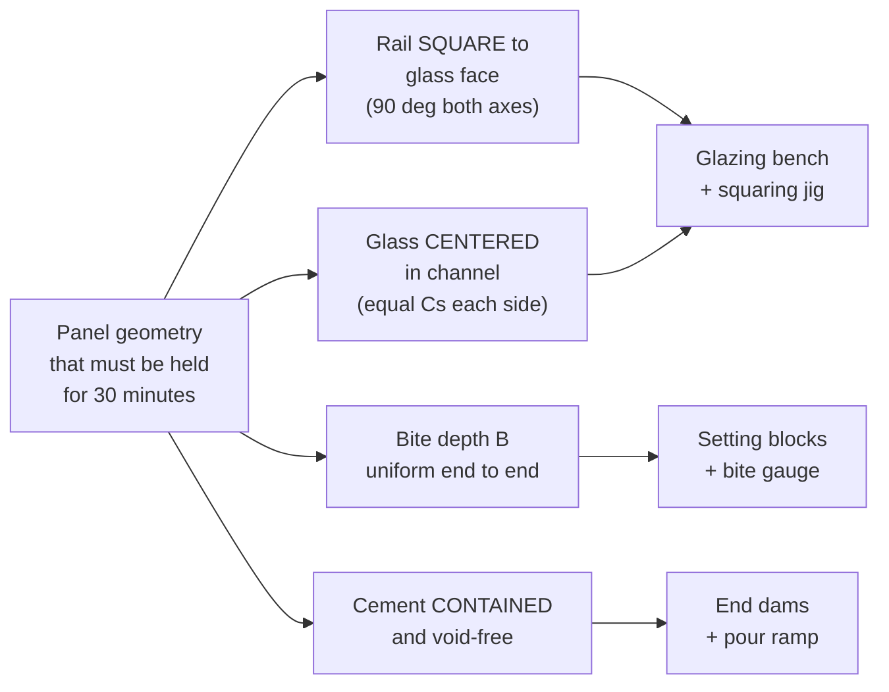

# 03 — Fixtures and Tooling

You asked whether special fixtures are needed. **No proprietary TORMAX fixture
is required**, but glazing a panel on two sawhorses will not hold tolerance. The
cement sets in 20–30 minutes; whatever geometry the panel has at minute 25 is
the geometry it has forever. Everything below is shop-buildable from plywood,
2x stock, and hardware store parts.

## What each fixture is actually for



---

## 3.1 The glazing bench

The reference surface. Everything else registers off it.

### Diagram 3.1 — Glazing bench, plan view

```
    ◄──────────────  L = panel width + 24" minimum  ──────────────►
  ┌───────────────────────────────────────────────────────────────────┐
  │  ┌─────────────────────────────────────────────────────────────┐  │
  │  │                                                             │  │
  │  │        3/4" MDF or melamine deck — the flat reference       │  │
  │  │        (crown up; check with a 6' straightedge)             │  │  W
  │  │                                                             │  │  =
  │  │   ┌───┐         ┌───┐         ┌───┐         ┌───┐           │  │  panel
  │  │   │ F │         │ F │         │ F │         │ F │           │  │  height
  │  │   └───┘         └───┘         └───┘         └───┘           │  │  + 18"
  │  │   felt / carpet pads under the glass — full width           │  │
  │  │                                                             │  │
  │  └─────────────────────────────────────────────────────────────┘  │
  │   ▲                                                           ▲   │
  └───┼───────────────────────────────────────────────────────────┼───┘
      │                                                           │
   LEVELLING FOOT                                          LEVELLING FOOT
   (4 corners + 2 mid, 3/8" carriage bolt + T-nut)

    Deck flatness requirement:  ±1/32" over any 6' span.
    Check with a straightedge and feeler gauge BEFORE every production run.
```

### Diagram 3.2 — Glazing bench, end elevation

```
                      ┌──────────────────────────────┐
        deck ────►    │▓▓▓▓▓▓▓▓▓▓▓▓▓▓▓▓▓▓▓▓▓▓▓▓▓▓▓▓▓▓│  3/4" MDF
                      ├──────────────────────────────┤
        torsion ──►   │  ╱╲  ╱╲  ╱╲  ╱╲  ╱╲  ╱╲  ╱╲  │  2x4 ladder frame
        frame         │  ╲╱  ╲╱  ╲╱  ╲╱  ╲╱  ╲╱  ╲╱  │  16" o.c.
                      ├──────────────────────────────┤
                      │    ║                    ║    │
        legs ─────►   │    ║                    ║    │  2x4, braced
                      │    ║                    ║    │
                      │   ═╩═                  ═╩═   │
                      └────┬────────────────────┬────┘
                           │                    │
                        ┌──┴──┐              ┌──┴──┐
                        │ ▓▓▓ │              │ ▓▓▓ │   levelling feet
                        └─────┘              └─────┘
        ═══════════════════════════════════════════════════ SHOP FLOOR

        Working height: 30"–34".  Low enough to see into the rail
        channel from above while pouring.
```

**Why level matters:** Por-Rok is mixed to a *flowable* consistency. If the
bench is out of level along its length, the cement runs to the low end and you
get a starved pour at the high end — which you cannot see, because the rail
hides it. Level the bench with a precision level in **both** axes and re-check
after moving it.

---

## 3.2 The squaring / centering jig

This is the fixture that does the real work. It holds the rail at 90° to the
glass and keeps the glass centered in the channel while the cement sets.

### Diagram 3.3 — Squaring jig, section through the rail

```
                            ┌──────────────┐
                            │  CLAMP       │   quick-action toggle clamp
                            │   ▼          │   or F-clamp, one per 24"
                            └──┬───────────┘
                               │
                        ┌──────┴──────┐
                        │  PRESSURE   │
                        │    PAD      │  hardwood, faced with felt
                        └──────┬──────┘
                               │
    ┌──────────────────────────┼──────────────────────────┐
    │                          ▼                          │
    │      ┌───────────────────────────────────┐          │
    │      │ ███  RAIL (inverted, channel up) │          │
    │      │ ███ ┌───────────────────────┐ ███ │          │
    │      │ ███ │                       │ ███ │          │
    │      │     │   ║           ║       │     │          │
    │  ┌───┴─┐   │   ║   GLASS   ║       │   ┌─┴───┐      │
    │  │ SIDE│───┼──►║           ║◄──────┼───│SIDE │      │
    │  │STOP │   │   ║           ║       │   │STOP │      │
    │  └───┬─┘   └───╫───────────╫───────┘   └─┬───┘      │
    │      │         ║           ║             │          │
    │      │         ║           ║             │          │
    │  ════╧═════════╩═══════════╩═════════════╧════      │
    │            BENCH DECK (felt-padded)                 │
    └─────────────────────────────────────────────────────┘

    SIDE STOPS are the centering element.  Cut them so that:

              stop face to stop face  =  Tg  (glass thickness)

    and they register the GLASS, not the rail.  The rail is then
    dropped over the glass and clamped down — it self-centers.

    Make the stops from 3/4" plywood, faced with UHMW or felt so
    they never touch bare glass edge-on.
```

### Diagram 3.4 — Squareness: the two angles that must both be 90°

```
    AXIS 1 — rail square to glass FACE (viewed from the panel end)

           OK                          NOT OK  (rail rolled)
      ┌──────────┐                    ┌──────────┐
      │ ║      ║ │                     ╲ ║      ║ ╲
      │ ║      ║ │                      ╲║      ║  ╲
      │ ║      ║ │                       ╲      ║   ╲
      └──────────┘                        ╲──────────╲
      ═══════════                        ═══════════
         90.0°                            ✘ panel will not run
                                            true in the track;
                                            hangers side-load

    AXIS 2 — rail square to glass EDGE (viewed from the front)

           OK                          NOT OK  (rail skewed / bite varies)
    ╔══════════════════╗              ╔══════════════════╗
    ║      GLASS       ║              ║      GLASS       ║
    ╚══════════════════╝              ╚══════════════════╝
    ┌──────────────────┐              ┌──────────────────┐
    │      RAIL        │              │  RAIL          ╱ │
    └──────────────────┘              └──────────────╱───┘
    B uniform end to end               B varies → uneven cement bed,
                                       panel hangs out of plumb
```

**Check both axes with an engineer's square before the pour and again at
5 minutes.** After 20 minutes it is too late to correct.

---

## 3.3 End dams

The rail channel is open at both ends. Without dams, a flowable pour simply runs
out onto the bench.

### Diagram 3.5 — End dam detail

```
              LOOKING INTO THE END OF THE RAIL

              ┌─────────────────────────┐
              │  ▒▒▒▒▒▒▒▒▒▒▒▒▒▒▒▒▒▒▒▒▒  │  ← dam plate: 1/2" HDPE or
              │  ▒▒▒▒┌───────────┐▒▒▒▒  │    plywood faced with packing
              │  ▒▒▒▒│           │▒▒▒▒  │    tape (cement will not stick)
              │  ▒▒▒▒│  ║     ║  │▒▒▒▒  │
              │  ▒▒▒▒│  ║GLASS║  │▒▒▒▒  │    Cut to the OUTSIDE profile of
              │  ▒▒▒▒│  ║     ║  │▒▒▒▒  │    the rail, with a slot for the
              │  ▒▒▒▒└──╫─────╫──┘▒▒▒▒  │    glass to pass through.
              │  ▒▒▒▒▒▒▒╨▒▒▒▒▒╨▒▒▒▒▒▒▒  │
              └─────────────────────────┘    Slot width = Tg + 1/32".
                    ▲             ▲
                    │             │          Seal the perimeter with
                 clamped or held by a        rope caulk or a foam gasket.
                 spring clamp against
                 the rail end


              SIDE VIEW — dam set back for the end cap

    ┌────────────────────────────────────────────────┐
    │▒│                                            │▒│
    │▒│           cement fill zone                 │▒│
    │▒│                                            │▒│
    └─┴────────────────────────────────────────────┴─┘
      │◄─ d ─►│                          │◄─ d ─►│

      d = end-cap depth + 1/8" clearance.  [VERIFY] from the rail
      drawing.  If you fill the full length, the end caps will not
      seat and you will be chiselling cured cement out of the ends.
```

---

## 3.4 Pour ramp / funnel

Poured straight from a bucket, the cement lands as a slug and traps air against
the glass. A ramp lays it in along the channel. CRL sells a purpose-made pouring
ramp and a wet-glaze pump for base shoes; either can be used here, or you can
fold one from sheet metal.

### Diagram 3.6 — Pour ramp

```
                 ┌──────────┐
                 │  BUCKET  │
                 │  ▓▓▓▓▓▓  │
                 └────┬─────┘
                      │  slow, continuous stream
                      ▼
              ╲───────────────╱
               ╲   RAMP      ╱      22 ga sheet metal or 1/8" HDPE,
                ╲  V-trough ╱       folded to ~60° included angle,
                 ╲─────────╱        12"–18" long
                      │
                      ▼  cement enters at a shallow angle,
                         flows ALONG the channel
    ┌─────────────────────────────────────────────────────┐
    │  ▓▓▓▓▓▓▓▓▓▓▓▓▓▓▓▓─────►                             │
    │  ▓▓▓▓▓▓▓▓▓▓▓▓▓▓▓▓─────►    advancing front pushes   │
    │  ▓▓▓▓▓▓▓▓▓▓▓▓▓▓▓▓─────►    air ahead of it          │
    └─────────────────────────────────────────────────────┘

    Pour into ONE side of the channel and let the cement travel
    UNDER the glass and up the far side.  Pouring both sides at
    once traps air directly beneath the glass edge — the one
    place a void is unacceptable.
```

### Diagram 3.7 — Why one-side pouring works

```
    ONE-SIDE POUR (correct)              BOTH-SIDES POUR (wrong)

    pour                                 pour            pour
     │                                    │                │
     ▼                                    ▼                ▼
    ┌──┬────────┬──┐                     ┌──┬────────┬──┐
    │▓▓│  ║  ║  │  │                     │▓▓│  ║  ║  │▓▓│
    │▓▓│  ║  ║  │  │  air escapes ──►    │▓▓│  ║  ║  │▓▓│
    │▓▓▓─►╚══╝◄─▓▓▓│  this way           │▓▓▓─►╔══╗◄─▓▓▓│
    │▓▓▓▓▓▓▓▓▓▓▓▓▓▓│                     │▓▓▓▓▓░░░░▓▓▓▓▓│ ← TRAPPED VOID
    └──────────────┘                     └──────────────┘   under the glass
                                                            edge
    Full bed under the edge.             Bearing area lost exactly where
                                         the load path needs it.
```

---

## 3.5 Bite gauge

A trivial fixture that eliminates the most common dimensional error.

### Diagram 3.8 — Bite gauge

```
         ┌────┐
         │    │  ← handle
         │    │
    ┌────┴────┴────┐  ── shoulder rides on the TOP OF THE RAIL
    │              │
    │              │        Blade length = B (glass bite)
    │    blade     │
    │              │        Make one gauge per rail type and
    │              │        stamp the dimension on the handle.
    └──────────────┘  ── blade tip touches the GLASS EDGE

    Check at both ends and at mid-span before the pour.
    If the blade rocks or gaps, the bite is wrong — fix it
    by changing setting block thickness, NOT by pressing
    the rail down harder.
```

---

## 3.6 Full tool list

| Tool | Notes |
|---|---|
| Glazing bench, levelled | §3.1 |
| Squaring/centering jig + toggle clamps | §3.2, one clamp per 24" of rail |
| End dams (pair per rail size) | §3.3 |
| Pour ramp or CRL wet-glaze pump | §3.4 |
| Bite gauge | §3.5, one per rail type |
| Engineer's square, 6" and 12" | Squareness checks |
| Precision level, 24" | Bench setup and panel check |
| 6' straightedge + feeler gauges | Deck flatness |
| Mixing drill, 1/2" low-speed + paddle | Cement must be lump-free |
| Graduated mixing bucket + measuring jug | Water ratio is not eyeballed |
| Margin trowel, acid brush, putty knife | Placing and striking off |
| Sponges + clean water, 2 buckets | Wipe-down before initial set |
| Caulking gun, tooling spatulas | Cap bead |
| Glass suction cups (2-cup min) | Handling the lite |
| Timer | The 20–30 min set window is not negotiable |
| PPE: goggles, nitrile, N95, cut gloves | — |

---

## Sources

- [CRL — Pouring Ramp for Base Shoe Applications Using Expansion Cement](https://www.crlaurence.com/All-Products/Railing-Systems-&-Windscreens/Glass-Railing-Systems-&-Components/Glass-Railing-Installation-Tools-&-Accessories/CRL-Pouring-Ramp-for-Base-Shoe-Applications-Using-Expansion-Cement/p/GRP35)
- [CRL — Wet Glaze Pump and Accessories](https://www.crlaurence.com/All-Products/Railing-Systems-&-Windscreens/Glass-Railing-Systems-&-Components/Glass-Railing-Installation-Tools-&-Accessories/CRL-Wet-Glaze-Pump-and-Accessories/p/GRP1)
- [Door Closers USA — How To Install Glass In A Commercial Storefront Door](https://www.doorclosersusa.com/How-To-Install-Glass-In-A-Commercial-Storefront-Door-s/34470.htm) — bench/sawhorse layup, setting block placement
