# 04 — Glazing Procedure (SOP)

**Scope:** wet-setting 1/2" tempered glass into TORMAX TX9500 aluminum door
rails (shoes), top and bottom, on a shop bench.

**Prerequisites:** [07 — Verification checklist](07-verification-checklist.md)
signed off. Cement selected per [02 §2.1](02-material-selection.md). Fixtures
built and checked per [03](03-fixtures-and-tooling.md).

> **STOP CONDITION.** Do not begin if the rails are a *dry-glaze* type. Dry-glaze
> rails use gaskets and wedges and are destroyed by cementing. Confirm the rail
> type first.

---

## Diagram 4.1 — Full process map

```mermaid
flowchart TD
    subgraph PREP["PREP — no time pressure"]
        A1["1. Verify paperwork<br/>+ rail type"] --> A2["2. Inspect glass"]
        A2 --> A3["3. Prep + coat rails<br/>if required"]
        A3 --> A4["4. Set up bench,<br/>level both axes"]
        A4 --> A5["5. Dry fit:<br/>blocks, glass, rail"]
        A5 --> A6["6. Check bite +<br/>both square axes"]
        A6 --> A7["7. Fit end dams<br/>+ dam tape"]
        A7 --> A8["8. Stage tools,<br/>water, PPE"]
    end

    A8 --> B0

    subgraph POUR["POUR — 20-30 min clock per rail"]
        B0["9. Mix batch 1"] --> B1["10. Pour bottom rail<br/>one side only"]
        B1 --> B2["11. Verify fill<br/>+ re-check square"]
        B2 --> B3["12. Strike off<br/>to dam line"]
        B3 --> B4["13. Wipe all squeeze-out<br/>BEFORE set"]
        B4 --> B5["14. Repeat 9-13<br/>for TOP rail"]
    end

    B5 --> C1

    subgraph CURE["CURE — do not disturb"]
        C1["15. Initial set<br/>20-30 min"] --> C2["16. Strip dams,<br/>clean ends"]
        C2 --> C3["17. Cap bead<br/>+ tool"]
        C3 --> C4["18. Full cure<br/>see timeline"]
    end

    C4 --> D1["19. QC sign-off"]
    D1 --> D2["20. Stand panel,<br/>fit hangers + guides"]
    D2 --> D3["21. Hang + commission"]
```



---

## PREP PHASE

### Step 1 — Verify paperwork and rail type

- [ ] Shop drawing on the bench, with the variable table from
      [01](01-system-overview.md#panel-variables--fill-these-in-from-the-shop-drawing)
      filled in — no blanks.
- [ ] Rail confirmed as **wet-glaze**, not dry-glaze.
- [ ] Cement brand, product, and TDS revision recorded on the QC sheet.
- [ ] Interior vs exterior exposure determined; cement matched to it.

### Step 2 — Inspect the glass

Tempered glass cannot be cut, ground, or drilled after tempering. Any defect
found now is a reorder, not a rework.

```
    INSPECT THE ENTIRE PERIMETER, BOTH FACES, UNDER RAKING LIGHT

    ┌────────────────────────────────────────────────────────┐
    │ ◄────────────────── check all 4 edges ───────────────► │
    │  ▲                                                  ▲  │
    │  │   ┌──────────────────────────────────────────┐   │  │
    │  │   │                                          │   │  │
    │  │   │          field: check for bow,           │   │  │
    │  │   │          roller wave, scratches          │   │  │
    │  │   │                                          │   │  │
    │  │   └──────────────────────────────────────────┘   │  │
    │  ▼                                                  ▼  │
    │ ══════════════════════════════════════════════════════ │
    └────────────────────────────────────────────────────────┘
       ▲▲▲ THE BITE ZONE — the bottom B inches of each glazed
           edge. A chip, shell, or vent here is an automatic
           reject. This is where the cement will clamp the lite.

    REJECT for: any edge chip, shell chip, flake, or open vent
                in the bite zone
                any corner damage
                edges not seamed / arrised
                dimensional error vs shop drawing
```

- [ ] All four edges seamed or polished per the drawing.
- [ ] No chips, shells, or vents anywhere in the bite zone.
- [ ] Glass size measured and matches drawing — record actual.
- [ ] Tempering stamp/logo located and its final orientation confirmed against
      the drawing before the rails go on. Once cemented, you cannot flip it.

### Step 3 — Prepare the rails

- [ ] Blow out the channel; remove swarf, chips, and packing debris.
- [ ] Solvent-wipe the channel interior; remove all mill oil and fingerprints.
      Cement will not bond to oil.
- [ ] Let solvent flash off completely.
- [ ] **If using Super Por-Rok or any Portland-based cement:** apply bituminous
      coating per [02 §2.4](02-material-selection.md#24-isolation-coating-only-when-using-super-por-rok-or-any-portland-based-cement).
      Two coats, second at 90° to the first. Dry fully between coats and before
      pouring. Mask exposed architectural faces.
- [ ] Mask the outside of the rail either side of the lip with tape — this is
      what saves you the cleanup.

```
    MASKING — do this, every time

    ┌──────────────────────────────────────────────┐
    │▒▒▒▒▒▒▒▒▒▒▒▒▒ masking tape ▒▒▒▒▒▒▒▒▒▒▒▒▒▒▒▒▒▒│  ← 1" band, both faces,
    ├──────────────────────────────────────────────┤    full length, top edge
    │              rail lip                        │    of tape parallel to
    │                                              │    and ~1/8" below the
                                                        rail lip
    Cement squeeze-out lands on tape, not anodizing.
    Strip the tape while the cement is still plastic.
```

### Step 4 — Set up the bench

- [ ] Deck flatness checked: ±1/32" over any 6' span.
- [ ] Bench levelled in **both** axes with a precision level.
- [ ] Felt/carpet pads laid where the glass will sit.
- [ ] Squaring jig side stops set to `Tg`; faces clean and undamaged.

### Step 5 — Dry fit

Do the whole assembly dry first. Every problem you find here is free.

1. Place setting blocks in the rail channel at the quarter points
   ([02 Diagram 2.3](02-material-selection.md#diagram-23--setting-block-layout-elevation-looking-at-the-rail)).
2. Lower the glass onto the blocks using suction cups. **Two people minimum.**
3. Bring the rail up over the glass (or lower the glass into an inverted rail —
   whichever the bench is set up for) and clamp lightly.

### Step 6 — Check bite and both square axes

- [ ] Bite `B` checked with the bite gauge at **both ends and mid-span** — equal
      at all three.
- [ ] Axis 1 (rail square to glass face) checked with an engineer's square at
      three points.
- [ ] Axis 2 (rail square to glass edge) checked — bite uniform end to end.
- [ ] Side gap `Cs` equal on both faces. Check with a feeler gauge or a pair of
      matched shims at three points.

```
    THREE-POINT CHECK — every rail, every time

    ┌───────────────────────────────────────────────────────┐
    │   ✔                        ✔                      ✔   │
    │   │                        │                      │   │
    │  END                    MIDSPAN                  END  │
    │                                                       │
    │  At each point measure:  B (bite)                     │
    │                          Cs left / Cs right           │
    │                          90 deg, axis 1               │
    └───────────────────────────────────────────────────────┘

    Tolerance: see 06 — QC and troubleshooting.
```

### Step 7 — End dams and dam tape

- [ ] End dams fitted, set back by `d` for the end caps, perimeter sealed with
      rope caulk.
- [ ] Closed-cell foam dam tape run along both sides of the channel at the fill
      line, creating the cap-bead reservoir.

```
    DAM TAPE POSITION (rail section)

    ┌────┬─────────────┬────┐  ── top of rail
    │    │      ║      │    │
    │████│      ║      │████│  ← foam dam tape.  Top of tape = top of
    │████│      ║      │████│    rail (or slightly below).  Depth of
    ├────┤      ║      ├────┤    tape = cap bead depth, ~3/8".
    │▓▓▓▓│      ║      │▓▓▓▓│
    │▓▓▓▓│      ║      │▓▓▓▓│  ← cement fills to the UNDERSIDE of
    │▓▓▓▓│      ║      │▓▓▓▓│    the tape, no higher
    │▓▓▓▓│      ╚══════╡▓▓▓▓│
    │▓▓▓▓│   [ BLOCK ]  │▓▓▓│
    └────┴──────────────┴───┘
```

### Step 8 — Stage everything

Once water hits powder you have 20–30 minutes. Everything must be within reach
before you mix: water buckets, sponges, trowel, ramp, timer, second batch of
powder pre-measured.

---

## POUR PHASE

### Step 9 — Mix

Per the Por-Rok data sheet: **16 oz of water per 5 lb of powder** for a smooth,
flowable interior consistency. [VERIFY] against the bucket in your shop — ratios
differ between Por-Rok and Super Por-Rok and between brand revisions.

**Method:**
1. Measure water into the bucket **first**.
2. Add powder to water while mixing. Never the reverse — it lumps.
3. Mix with a low-speed drill and paddle for 2–3 minutes to a lump-free,
   pourable consistency.
4. **Do not retemper.** Do not add water after the mix has begun to stiffen.
   Retempering destroys strength. Discard and mix fresh.

#### Batch size table

Calculate the volume first — running out mid-pour ruins the panel, because the
cold joint between two batches is a plane of weakness right through the
structural bed.

```
    Fill volume per rail, cubic inches:

        V  =  Lf  ×  ( Wc × B_fill  −  Tg × B )

    where   Lf      = fill length (rail length less both end setbacks)
            Wc      = internal channel width
            B_fill  = fill depth (glass edge to fill line, plus Sb)
            Tg      = glass thickness
            B       = glass bite

    Simplified, since the glass displaces its own slab:

        V  ≈  Lf × Cs × B × 2      (the two side gaps)
            + Lf × Wc × Sb         (the bed under the glass edge)

    Then:   powder (lb)  =  V (in³) / yield (in³ per lb, from the TDS)

    MIX 20% EXTRA.  Waste is cheap; a cold joint is not.
```

| Panel width | Approx. rails | Batch guidance |
|---|---|---|
| Up to 36" | 1 rail per batch | Single mix, pour, done |
| 36"–60" | 1 rail per batch | Single mix; have a helper on the ramp |
| Over 60" | 1 rail per batch | **Two mixers working in parallel**, both batches poured wet-on-wet |

> Never split one rail across two sequentially-mixed batches unless the second
> is poured into the first while it is still fluid.

### Step 10 — Pour the BOTTOM rail

- Pour into **one side of the channel only**, via the ramp, at a shallow angle.
- Start at one end and walk the pour along, letting the advancing front push air
  ahead of it and up the far side.
- Keep the stream continuous. Stopping and restarting creates layer boundaries.

```
    POUR SEQUENCE — walk the ramp

    start                                                    finish
      │                                                         │
      ▼                                                         ▼
    ┌─────────────────────────────────────────────────────────────┐
    │ ▓▓▓▓▓▓▓▓▓▓▓▓▓▓▓▓▓▓▓▓▓▓▓▓▓─────────►                        │
    └─────────────────────────────────────────────────────────────┘
              cement travels under the glass and rises
              on the far side — watch for it to appear

    ✔ Far side rises evenly  →  bed is full
    ✘ Far side stays low     →  STOP, probe, the pour is bridging
```

### Step 11 — Verify fill and re-check square

- [ ] Cement visible and level on **both** sides of the glass, full length.
- [ ] Probe gently with an acid brush handle at 3–4 points to confirm there is
      no void under the glass edge.
- [ ] **Re-check both square axes and the bite immediately.** The pour can float
      the rail. This is your last chance to correct — you have roughly 5 minutes.

### Step 12 — Strike off

Strike the cement level to the underside of the dam tape with a margin trowel.
Do not overfill into the cap-bead reservoir.

### Step 13 — Clean squeeze-out NOW

Por-Rok reaches 5,000 psi one hour after set. Anything you do not remove while
it is plastic becomes a chisel job on an anodized finish.

- [ ] Strip masking tape while cement is still plastic.
- [ ] Sponge all faces with clean water, changing water frequently.
- [ ] Final wipe with a clean damp sponge, then dry.

### Step 14 — Repeat for the TOP rail

Identical procedure. **Give it more attention, not less** — this is the
structural, tension-critical joint that carries the whole panel
([01 Diagram 1.2](01-system-overview.md#diagram-12--load-path-comparison)).

---

## CURE PHASE

### Step 15–18 — Cure and finish

### Diagram 4.2 — Cure and handling timeline

```
  T+0        T+20-30min      T+1hr         T+24hr        T+7d        T+28d
   │              │             │             │            │           │
   ▼              ▼             ▼             ▼            ▼           ▼
  POUR        INITIAL SET    5,000 psi     5,200 psi    6,800 psi   9,000 psi
   │              │             │             │            │           │
   ├──────────────┤             │             │            │           │
   │ DO NOT TOUCH │             │             │            │           │
   │ the panel.   │             │             │            │           │
   │ No clamping  │             │             │            │           │
   │ changes, no  │             │             │            │           │
   │ movement,    │             │             │            │           │
   │ no vibration │             │             │            │           │
   │              │             │             │            │           │
   │              ├─────────────┤             │            │           │
   │              │ Strip dams. │             │            │           │
   │              │ Clean ends. │             │            │           │
   │              │ Tool cap    │             │            │           │
   │              │ bead.       │             │            │           │
   │              │ PANEL STAYS │             │            │           │
   │              │ FLAT.       │             │            │           │
   │              │             │             │            │           │
   │              │             ├─── ── ── ───┤            │           │
   │              │             │ EARLIEST the panel may   │           │
   │              │             │ be stood upright.        │           │
   │              │             │ [VERIFY] — prefer 24hr   │           │
   │              │             │ before it carries load.  │           │
   │              │             │             │            │           │
   │              │             │             ├────────────┤           │
   │              │             │             │ HANG the panel.        │
   │              │             │             │ Fit hangers, guides,   │
   │              │             │             │ commission operator.   │
```

> **Recommended practice:** even though Por-Rok reaches 5,000 psi one hour after
> set, do not hang a panel before **24 hours**. The one-hour figure is a
> compressive number from a lab cube. Your top rail is loading the bed in
> tension and shear, in a confined channel, on a bond that is still gaining. The
> cost of waiting a day is a day. The cost of not waiting is a lite of tempered
> glass on the floor of an entrance lobby.

### Step 17 — Cap bead

```
    CAP BEAD DETAIL

    ┌────┬─────────────┬────┐  ── top of rail
    │~~~~│      ║      │~~~~│  ← neutral-cure silicone, tooled
    │~~~~│      ║      │~~~~│    concave, full contact both
    ├────┤      ║      ├────┤    to rail lip and to glass
    │▓▓▓▓│      ║      │▓▓▓▓│
    │▓▓▓▓│      ║      │▓▓▓▓│  ← cured cement
    │▓▓▓▓│      ║      │▓▓▓▓│

    - Both faces of both rails, full length.
    - Neutral-cure ONLY.  Acetoxy corrodes aluminum.
    - Tool it: an untooled bead has no adhesion at the edges.
    - Wipe the glass with alcohol before beading.
```

For an exterior panel, the cap bead is the primary water exclusion for the
glazing pocket. It is not cosmetic.

---

## POST-CURE

### Step 19 — QC sign-off

Complete the inspection in [06](06-qc-and-troubleshooting.md) before the panel
leaves the bench.

### Step 20 — Stand and fit hardware

- Stand the panel with two people and suction cups.
- Fit hangers/carriers into the top rail, guides into the bottom rail, per the
  TORMAX manual. [VERIFY] fastener torque from the TORMAX manual — do not guess.

### Step 21 — Hang and commission

Per the TORMAX TX9200/TX9500 installation and service manual. Out of scope for
this document.

---

## Sources

- [Por-Rok Technical Datasheet (PDF)](https://specchem.com/wp-content/uploads/2023/03/Por-Rok-Tech-Sheet.pdf) — mix ratio, set time, strength gain
- [Por-Rok Technical Datasheet, Rev. 2-15 (PDF)](https://www.aprsupply.com/ASSETS/DOCUMENTS/ITEMS/EN/APR_CHEMICAL_PORROKTECHNINFO.pdf)
- [ICC-ES ESR-3269 (PDF)](https://azure.crlaurence.com/datasheets/pdfs/ESR-3269.pdf) — wet glazing grout must be continuous, filling all voids
- [Door Closers USA — Storefront Door Glazing Guide](https://www.doorclosersusa.com/Storefront-Door-Glazing-Guide-Aluminum-Glass-Doors-s/36240.htm)
- [Viracon — Glazing Guidelines](https://viracon.com/glazing-guidelines/)
- [TORMAX TX9200/TX9500 Installation & Service Manual (PDF)](https://d3eu1jnerk19h.cloudfront.net/documents/products/TX9200-TX9500-TCP-Slide-Manual-V-2-11-2-09.pdf)
