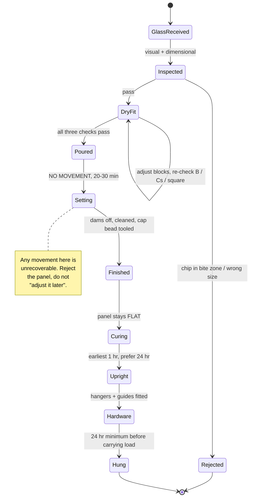

# 05 — Diagram Pack

Reference drawings. Print the ones you need and put them on the bench.

**Every dimension shown as a symbol (`B`, `Cs`, `Tg`, `Hr`, `Wc`, `Sb`) must be
filled in from the shop drawing** — see the variable table in
[01](01-system-overview.md#panel-variables--fill-these-in-from-the-shop-drawing).
Typical values shown are industry-general, **not TORMAX-approved dimensions**.

---

## D-1 — Master rail section, glazed (the drawing to memorise)

```
                        │◄────────── Wr ──────────►│
                        │                          │
      ROOM SIDE         │                          │       EXTERIOR SIDE
                        │                          │
                    ┌───┴──────────────────────────┴───┐ ─── top of rail
                    │  ~~~~~~~ ║          ║ ~~~~~~~    │  ▲
                    │  ~~~~~~~ ║          ║ ~~~~~~~    │  │ cap bead
                    │ ┌──────┐ ║          ║ ┌──────┐   │  │ (neutral silicone)
                    │ │██████│ ║          ║ │██████│   │  ▼ tooled concave
                    │ │██████│ ║          ║ │██████│   │  ─── dam tape /
                    │ └──────┘ ║          ║ └──────┘   │      backer
                    │ ▓▓▓▓▓▓▓▓ ║          ║ ▓▓▓▓▓▓▓▓   │  ▲
                    │ ▓▓▓▓▓▓▓▓ ║          ║ ▓▓▓▓▓▓▓▓   │  │
                    │ ▓▓▓▓▓▓▓▓ ║  GLASS   ║ ▓▓▓▓▓▓▓▓   │  │
              ▲     │ ▓▓▓▓▓▓▓▓ ║   Tg     ║ ▓▓▓▓▓▓▓▓   │  │  POR-ROK
              │     │ ▓▓▓▓▓▓▓▓ ║          ║ ▓▓▓▓▓▓▓▓   │  │  fill zone
              │     │ ▓▓▓▓▓▓▓▓ ║          ║ ▓▓▓▓▓▓▓▓   │  │
         B    │     │ ▓▓▓▓▓▓▓▓ ║          ║ ▓▓▓▓▓▓▓▓   │  │
       (bite) │     │ ▓▓▓▓▓▓▓▓ ║          ║ ▓▓▓▓▓▓▓▓   │  │
              │     │ ▓▓▓▓▓▓▓▓ ╚══════════╝ ▓▓▓▓▓▓▓▓   │  │ ─── glass edge
              ▼     │ ▓▓▓▓▓▓▓▓ ┌──────────┐ ▓▓▓▓▓▓▓▓   │  │
                 ▲  │ ▓▓▓▓▓▓▓▓ │  SETTING │ ▓▓▓▓▓▓▓▓   │  │
              Sb │  │ ▓▓▓▓▓▓▓▓ │   BLOCK  │ ▓▓▓▓▓▓▓▓   │  │
                 ▼  │ ▓▓▓▓▓▓▓▓ └──────────┘ ▓▓▓▓▓▓▓▓   │  ▼
                    └───┬──────────────────────────┬───┘ ─── rail floor
                        │◄─Cs─►│          │◄─Cs─►│
                        │◄────────── Wc ──────────►│

    Cs = (Wc − Tg) / 2      must be EQUAL both sides
    B  = measured from TOP OF RAIL to GLASS EDGE
    Sb = setting block thickness = cement bed depth under the edge
```

---

## D-2 — Panel elevation with all glazing dimensions

```
        │◄──────────────────────── Lg ────────────────────────►│
   ┌────┴──────────────────────────────────────────────────────┴────┐
   │                          TOP RAIL                              │  ▲
   │    ◊ hanger              ◊ hanger              ◊ hanger        │  Hr_top
   └────┬──────────────────────────────────────────────────────┬────┘  ▼
        │▓▓▓▓▓▓▓▓▓▓▓▓▓▓▓▓▓▓ cement bed ▓▓▓▓▓▓▓▓▓▓▓▓▓▓▓▓▓▓▓▓▓▓▓│  ← B
   ╔════╧══════════════════════════════════════════════════════╧════╗
   ║                                                                 ║
   ║                                                                 ║
   ║                                                                 ║  ▲
   ║                    1/2" TEMPERED GLASS                          ║  │
   ║                                                                 ║  │ Hg
   ║                    (daylight opening)                           ║  │
   ║                                                                 ║  ▼
   ║                                                                 ║
   ╚════╤══════════════════════════════════════════════════════╤════╝
        │▓▓▓▓▓▓▓▓▓▓▓▓▓▓▓▓▓▓ cement bed ▓▓▓▓▓▓▓▓▓▓▓▓▓▓▓▓▓▓▓▓▓▓▓│  ← B
   ┌────┴──────────────────────────────────────────────────────┴────┐  ▲
   │        ▪ block              ▪ block              ▪ block       │  Hr_bot
   │                       BOTTOM RAIL                              │  ▼
   └────┬──────────────────────────────────────────┬───────────────┘
        │                                          │
     ┌──┴──┐                                    ┌──┴──┐
     │GUIDE│                                    │GUIDE│
     └─────┘                                    └─────┘

   Overall panel height = Hr_top + Hg + Hr_bot − (2 × B)
                          ^ because the glass is INSIDE the rails by B
                            at each end.  This is the #1 arithmetic
                            error on all-glass panels.
```

---

## D-3 — Glass sizing arithmetic

```
    GIVEN:  required overall panel height  Hp
            rail heights  Hr_top, Hr_bot
            bite  B  (same top and bottom, usually)

    THEN:   glass height  Hgl = Hp − Hr_top − Hr_bot + 2B


    ┌──────────────┐  ─┬─ Hr_top
    │   TOP RAIL   │   │            ─┬─
    ├ ─ ─ ─ ─ ─ ─ ─┤  ─┴─   B        │
    │              │                 │
    │              │                 │
    │    GLASS     │                 │  Hgl  (actual glass height)
    │              │                 │
    │              │                 │
    ├ ─ ─ ─ ─ ─ ─ ─┤  ─┬─   B        │
    │ BOTTOM RAIL  │   │            ─┴─
    └──────────────┘  ─┴─ Hr_bot

    │◄── Hp ──►│  overall

    ⚠  Order the glass from THIS calculation, using the ACTUAL
       measured rail heights, not the catalogue ones.  Tempered
       glass cannot be trimmed.
```

---

## D-4 — Setting block placement, plan and elevation

```
    ELEVATION (looking at the rail face)

    │◄──────────────────────── Lg ────────────────────────►│
    │                                                      │
    │  ≥4"                                            ≥4"  │
    │  ├─►│                                        │◄─┤    │
    ┌──────────────────────────────────────────────────────┐
    │      ┌────┐            ┌────┐            ┌────┐      │
    │      │ B1 │            │ B2 │            │ B3 │      │
    │      └────┘            └────┘            └────┘      │
    └──────────────────────────────────────────────────────┘
           │◄──── ≤30" ────►│◄──── ≤30" ────►│


    PLAN (looking down into the channel)

    ┌──────────────────────────────────────────────────────┐
    │ ░░░░░░░░░░░░░░░░░░░░░░░░░░░░░░░░░░░░░░░░░░░░░░░░░░░░ │  cement
    │ ░░░░┌────┐░░░░░░░░░░░░░┌────┐░░░░░░░░░░░░┌────┐░░░░░ │
    │ ░░░░│████│░░░░░░░░░░░░░│████│░░░░░░░░░░░░│████│░░░░░ │  blocks
    │ ░░░░└────┘░░░░░░░░░░░░░└────┘░░░░░░░░░░░░└────┘░░░░░ │
    │ ░░░░░░░░░░░░░░░░░░░░░░░░░░░░░░░░░░░░░░░░░░░░░░░░░░░░ │
    └──────────────────────────────────────────────────────┘
          │                                          │
          └── block width = Tg + 1/16"  ─────────────┘
              block length ≥ 4", and ≥ 0.1" per ft² of glass
```

---

## D-5 — Top rail: relationship between hanger bolts and the glass edge

This is the geometry that decides whether the panel hangs plumb.

```
                    ┌────────┐         ┌────────┐
                    │ HANGER │         │ HANGER │
                    └───┬────┘         └───┬────┘
                        │  bolt            │  bolt
    ┌───────────────────┼──────────────────┼──────────────────┐
    │                   ▼                  ▼                  │
    │   ═══════════════════════════════════════════════════   │ ← boss / web
    │                                                         │
    │   ▓▓▓▓▓▓▓▓▓▓▓▓▓▓▓▓▓▓▓▓▓▓▓▓▓▓▓▓▓▓▓▓▓▓▓▓▓▓▓▓▓▓▓▓▓▓▓▓▓▓▓   │ ← cement
    │   ▓▓▓▓▓▓▓▓▓▓▓▓▓▓▓▓▓▓▓▓▓▓▓▓▓▓▓▓▓▓▓▓▓▓▓▓▓▓▓▓▓▓▓▓▓▓▓▓▓▓▓   │
    │   ▓▓▓▓▓▓▓▓▓╔═══════════════════════════╗▓▓▓▓▓▓▓▓▓▓▓▓▓   │ ← glass edge
    └────────────╫───────────────────────────╫────────────────┘
                 ║           GLASS           ║

    ⚠  The bolt bosses must NOT bottom out on the glass edge and must
       not reduce B below the drawing value.  Check clearance during
       the DRY FIT (Step 5), with the hangers loosely fitted, before
       any cement goes in.

    ⚠  Load path:  glass → cement → rail wall → web → bolt → hanger.
       Every one of those interfaces is in the chain.  A void in the
       cement directly beneath a hanger is the worst place for one.

    Hanger positions ────────►  mark them on the masking tape during
                                dry fit, and confirm the pour is full
                                and void-free at each mark.
```

---

## D-6 — Water management on an exterior panel

```
                    RAIN / WASHDOWN / MOPPING
                          │  │  │  │
                          ▼  ▼  ▼  ▼
    ╔═══════════════════════════════════════════╗
    ║                  GLASS                    ║
    ╚═══════════════════════════════════════════╝
              │ water runs down the face │
              ▼                          ▼
    ┌─────────┴──────────────────────────┴──────┐
    │ ~~~~~~~~~~ CAP BEAD ~~~~~~~~~~~~~~~~~~~~~ │ ← first line of defence.
    │                                           │   Continuous, tooled,
    │ ▓▓▓▓▓▓▓▓▓▓▓▓▓▓▓▓▓▓▓▓▓▓▓▓▓▓▓▓▓▓▓▓▓▓▓▓▓▓▓▓ │   no gaps at the ends.
    │ ▓▓▓▓▓▓▓▓▓ CEMENT BED ▓▓▓▓▓▓▓▓▓▓▓▓▓▓▓▓▓▓▓ │
    │ ▓▓▓▓▓▓▓▓▓▓▓▓▓▓▓▓▓▓▓▓▓▓▓▓▓▓▓▓▓▓▓▓▓▓▓▓▓▓▓▓ │ ← if this is GYPSUM-based
    └───────────────────────────────────────────┘   Por-Rok, any breach of
    ══════════════════════════════════════════════  the cap bead starts a
              FLOOR — standing water               slow strength loss you
                                                   will not see until the
                                                   joint lets go.

    THIS IS WHY THE CEMENT CHOICE IN 02 MATTERS.
    A cap bead is a seal, not a guarantee.  Sealant is a
    10–20 year consumable; the cement bed is meant to be permanent.
    Do not design a permanent element to depend on a consumable one.
```

---

## D-7 — Failure mode gallery

```
  1. VOID UNDER EDGE          2. GLASS OFF-CENTRE        3. RAIL SKEWED

  ┌───┬──────┬───┐            ┌───┬──────┬───┐           ┌──────────────┐
  │ ▓ │  ║   │ ▓ │            │▓▓▓│ ║    │▓  │           │ ╔══════════╗ │
  │ ▓ │  ║   │ ▓ │            │▓▓▓│ ║    │▓  │           │ ║  GLASS   ╱ │
  │ ▓ │  ╚═══╡ ▓ │            │▓▓▓│ ╚════╡▓  │           │ ╚════════╱   │
  │ ▓ │░░░░░░│ ▓ │            │▓▓▓│      │▓  │           │ ────────╱    │
  └───┴──────┴───┘            └───┴──────┴───┘           └──────────────┘
   ░ = trapped air             Cs unequal                 B varies end to end

  Cause: poured both sides,    Cause: no centering jig,   Cause: no square
  or poured too fast           or jig stops wrong width   check after pour

  Result: bearing area lost,   Result: thin side crushes  Result: panel hangs
  edge-origin fracture         under thermal movement     out of plumb, binds
                                                          in the track


  4. Cs TOO TIGHT             5. CEMENT ON BARE ALU      6. COLD JOINT
     (glass touching rail)       (Super Por-Rok)

  ┌──┬────────┬──┐            ┌───┬──────┬───┐           ┌──────────────┐
  │  │║      ║│  │            │▒▒▒│  ║   │▒▒▒│           │▓▓▓▓▓│░│▓▓▓▓▓ │
  │  │║ metal║│  │            │▒▒▒│──►║◄──│▒▒▒│           │▓▓▓▓▓│░│▓▓▓▓▓ │
  │  │║contact│  │            │▒▒▒│  ║   │▒▒▒│           │▓▓▓▓▓│░│▓▓▓▓▓ │
  └──┴────────┴──┘            └───┴──────┴───┘           └──────────────┘
                                                          batch 1 │ batch 2
  Point load. Spontaneous     Gas + corrosion product      set before batch 2
  fracture, often months      expanding in a closed        went in
  later.                      channel.
                                                          Plane of weakness
  Cause: Cs not checked,      Cause: no bituminous         right through the
  or rail forced down over    isolation coat               structural bed
  an oversize lite
```

---

## D-8 — Troubleshooting cause map

```mermaid
flowchart TD
    F["Panel fails inspection<br/>or fails in service"] --> C1["MATERIAL"]
    F --> C2["GEOMETRY"]
    F --> C3["PROCESS"]
    F --> C4["GLASS"]

    C1 --> M1["Wrong Por-Rok variant<br/>for the exposure"]
    C1 --> M2["Super Por-Rok on<br/>uncoated aluminum"]
    C1 --> M3["Retempered mix"]
    C1 --> M4["Wrong water ratio"]
    C1 --> M5["Acetoxy silicone<br/>instead of neutral"]

    C2 --> G1["Cs unequal —<br/>no centering jig"]
    C2 --> G2["Bite B wrong or<br/>varying"]
    C2 --> G3["Rail out of square,<br/>either axis"]
    C2 --> G4["Bench not flat<br/>or not level"]

    C3 --> P1["Void under glass edge —<br/>poured both sides"]
    C3 --> P2["Cold joint —<br/>batch ran out"]
    C3 --> P3["Panel moved before<br/>initial set"]
    C3 --> P4["Hung before adequate<br/>cure"]
    C3 --> P5["Squeeze-out left<br/>to harden"]

    C4 --> Q1["Edge chip in the<br/>bite zone"]
    C4 --> Q2["Glass sized from<br/>catalogue rail heights"]
    C4 --> Q3["No setting blocks,<br/>or blocks too narrow"]
```



---

## D-9 — Panel state machine (what a panel is allowed to have done to it)



---

## D-10 — QC measurement points

```
    MEASURE AND RECORD AT EVERY MARKED POINT, BOTH RAILS

    ┌──────────────────────────────────────────────────────────┐
    │  ①              ②              ③              ④          │  TOP RAIL
    └──────────────────────────────────────────────────────────┘
    ╔══════════════════════════════════════════════════════════╗
    ║                                                          ║
    ║                        GLASS                             ║
    ║                                                          ║
    ╚══════════════════════════════════════════════════════════╝
    ┌──────────────────────────────────────────────────────────┐
    │  ⑤              ⑥              ⑦              ⑧          │  BOTTOM RAIL
    └──────────────────────────────────────────────────────────┘

    At each point record:   B          (bite, from top of rail)
                            Cs_room    (side gap, room side)
                            Cs_ext     (side gap, exterior side)
                            square     (pass / fail, engineer's square)
                            fill       (cement visible both sides, Y/N)

    Points ① and ④ / ⑤ and ⑧ within 6" of the panel ends.
    Points ② and ③ / ⑥ and ⑦ at the third points.
    Add a point at every hanger location on the top rail.
```

---

## Sources

See the source lists in [01](01-system-overview.md#sources),
[02](02-material-selection.md#sources), [03](03-fixtures-and-tooling.md#sources),
and [04](04-glazing-procedure.md#sources). These diagrams are drawn from that
material plus general glazing practice; they are illustrative, not
manufacturer-issued details.
