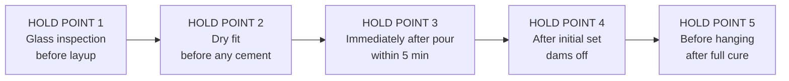
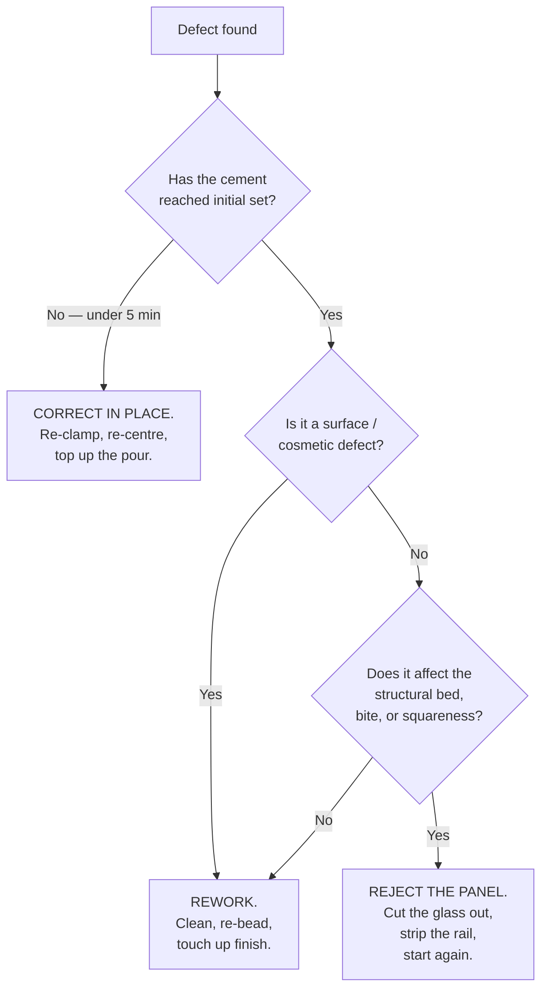

# 06 — QC and Troubleshooting

## 6.1 Inspection stages



A hold point means **work stops** until the check passes and is signed. Hold
Point 3 is the only one with a clock on it — you have roughly five minutes
before the cement is too stiff to correct.

---

## 6.2 Tolerances

> **[VERIFY] every value in this table against the TORMAX shop drawing.** These
> are working tolerances derived from general glazing practice, not TORMAX
> published limits. Where TORMAX specifies tighter, TORMAX wins.

| Measurement | Target | Working tolerance | Action if out |
|---|---|---|---|
| Bite `B` | Per drawing | ±1/16" | Adjust setting block thickness. Do **not** force the rail down. |
| `B` variation end-to-end, same rail | 0 | ≤1/16" | Re-seat; check bench flatness |
| Side gap `Cs`, room vs exterior | Equal | ≤1/32" difference | Re-centre in jig; check jig stop spacing = `Tg` |
| Rail square to glass face (axis 1) | 90.0° | ±0.5° | Re-clamp and re-check |
| Rail square to glass edge (axis 2) | 90.0° | ±0.5° | Re-seat blocks |
| Cement fill | Continuous, both sides, full length | No visible void | Reject — see §6.4 |
| Bench deck flatness | Flat | ±1/32" per 6' | Re-surface or shim deck |
| Bench level, both axes | Level | ±1/32" per 6' | Re-level before pouring |
| Cap bead | Continuous, tooled | No gaps, no gaps at ends | Cut out and redo |

---

## 6.3 QC record sheet

Copy one per panel.

```
  ┌────────────────────────────────────────────────────────────────────┐
  │  TX9500 PANEL GLAZING RECORD                                       │
  ├────────────────────────────────────────────────────────────────────┤
  │  Job ______________  Panel ID ____________  Date ________________  │
  │  Glazier ____________________  Checker __________________________  │
  ├────────────────────────────────────────────────────────────────────┤
  │  MATERIAL                                                          │
  │  Cement brand ______________  Product ____________________________ │
  │  TDS revision ______________  Batch / lot ________________________ │
  │  Exposure:   ☐ Interior      ☐ Exterior                            │
  │  Isolation coat required?  ☐ No   ☐ Yes → 2 coats applied ☐        │
  │  Setting blocks: durometer ______  size ____________  qty ________ │
  │  Water ratio used ______ oz per ______ lb                          │
  │  Mix time ______ min      Ambient temp ______ °F                   │
  ├────────────────────────────────────────────────────────────────────┤
  │  HOLD POINT 1 — GLASS                                              │
  │  ☐ Edges seamed/polished     ☐ No chips in bite zone               │
  │  ☐ No corner damage          ☐ Size matches drawing                │
  │  Measured glass:  W __________  H __________  Thk __________       │
  │  Temper stamp orientation confirmed ☐        Sign ________________ │
  ├────────────────────────────────────────────────────────────────────┤
  │  HOLD POINT 2 — DRY FIT          TOP RAIL          BOTTOM RAIL     │
  │  Point ①/⑤   B ______  Cs_r ______ Cs_e ______  sq ☐   fill n/a   │
  │  Point ②/⑥   B ______  Cs_r ______ Cs_e ______  sq ☐   fill n/a   │
  │  Point ③/⑦   B ______  Cs_r ______ Cs_e ______  sq ☐   fill n/a   │
  │  Point ④/⑧   B ______  Cs_r ______ Cs_e ______  sq ☐   fill n/a   │
  │  ☐ Hanger clearance checked with hangers loosely fitted            │
  │  ☐ End dams fitted, setback d = ______                             │
  │  Sign ________________                                             │
  ├────────────────────────────────────────────────────────────────────┤
  │  HOLD POINT 3 — POST-POUR (within 5 min)                           │
  │  Pour start time ________   Pour complete ________                 │
  │  ☐ Cement continuous both sides, full length, both rails           │
  │  ☐ Probed for voids at ≥4 points per rail                          │
  │  ☐ Square re-checked after pour, both axes, both rails             │
  │  ☐ B re-checked after pour                                         │
  │  ☐ Fill confirmed at every hanger mark                             │
  │  ☐ Squeeze-out wiped, masking stripped                             │
  │  Sign ________________                                             │
  ├────────────────────────────────────────────────────────────────────┤
  │  HOLD POINT 4 — AFTER SET                                          │
  │  Initial set at ________  ☐ Panel not moved during set             │
  │  ☐ Dams stripped clean    ☐ End cap pockets clear                  │
  │  ☐ No cement on finished faces                                     │
  │  ☐ Cap bead applied both faces both rails, neutral cure, tooled    │
  │  Sealant product __________________  Sign ________________         │
  ├────────────────────────────────────────────────────────────────────┤
  │  HOLD POINT 5 — RELEASE TO HANG                                    │
  │  Pour date/time ____________   Release date/time ________________  │
  │  Elapsed cure ________ hrs   (minimum 24 hrs recommended)          │
  │  ☐ Tap test passed, both rails, full length                        │
  │  ☐ No cracks, crazing, or shrinkage gaps in the bed                │
  │  ☐ Glass free of edge damage                                       │
  │  RELEASED BY ______________________  Date ________________         │
  └────────────────────────────────────────────────────────────────────┘
```

### The tap test

Before release, tap along the full length of both rails with the plastic handle
of a screwdriver, listening for change in tone.

```
    ┌──────────────────────────────────────────────────────────┐
    │  tap  tap  tap  tap  tap  tap  tap  tap  tap  tap  tap   │
    │   ●    ●    ●    ●    ●    ●    ●    ●    ●    ●    ●    │  every ~4"
    └──────────────────────────────────────────────────────────┘

    SOLID, dead "tock"  →  cement bed is continuous behind the wall
    HOLLOW, ringing     →  void.  Mark it and investigate.

    A hollow section under or near a hanger position is a
    reject, not a repair.
```

---

## 6.4 Troubleshooting

### Reject vs. rework



**There is no field repair for a bad cement bed.** You cannot inject, top up, or
re-pour a partially cured joint and get a monolithic bed. A panel with a void
under a hanger is scrap-and-restart.

### Symptom table

| Symptom | Likely cause | Fix |
|---|---|---|
| Cement won't rise on the far side during pour | Bridging — mix too stiff, or pouring too fast | Stop. Probe to release. If it has begun to set, reject. Next time: thinner mix within TDS ratio, slower pour |
| Mix lumpy / won't flow | Powder added to bucket before water; under-mixed | Discard. Water first, then powder, mix 2–3 min |
| Mix stiffened before the rail was full | Batch too small; hot shop; slow crew | Reject panel. Pre-measure a full batch +20%; two mixers for panels over 60" |
| `Cs` unequal after pour | Jig stops not set to `Tg`, or rail floated during pour | Correct within 5 min; otherwise reject |
| `B` grew during pour | Rail floated up on the fluid cement | Clamp the rail down positively, not just gravity |
| Panel hangs out of plumb | Rail out of square, axis 1 | Reject. Not adjustable at the hanger |
| Panel binds / drags in track | Rail rolled (axis 1) or panel twisted during cure | Check bench flatness. Reject panel |
| White bloom on the finish | Cement squeeze-out left to harden | Should have been wiped before set. Mechanical removal risks the anodizing |
| Cement crumbles / soft after months, exterior door | Gypsum-based regular Por-Rok used in a wet location | Full re-glaze with the correct product. See [02](02-material-selection.md) |
| Rail seam splitting / bulging | Super Por-Rok against uncoated aluminum | Reject immediately. Do not put the panel into service |
| Glass cracks from an edge weeks after install | Void causing point load, or metal-to-glass contact, or expansion pressure | Root cause via this table; the panel is scrap |
| Cap bead peeling from aluminum | Acetoxy silicone used, or unclean/untooled bead | Cut out, clean with alcohol, re-bead with neutral cure, tool it |

---

## 6.5 What to do when a panel is rejected

1. **Take it out of the flow immediately.** Tag it. A rejected panel that stays
   on the bench gets fitted by the next shift.
2. **Record the cause on the QC sheet** before scrapping. The record is how the
   second panel avoids the first panel's mistake.
3. **Do not reuse the glass** if the rejection involved any edge contact,
   cracking, or forced fitting. Tempered glass carries damage invisibly.
4. **Rails can usually be recovered** — chip out the cured cement carefully,
   strip and re-coat. Inspect the channel for gouges from the chisel; a gouge in
   an isolation coating must be re-coated.

---

## Sources

- [ICC-ES ESR-3269 (PDF)](https://azure.crlaurence.com/datasheets/pdfs/ESR-3269.pdf) — grout must be continuous, filling all voids
- [Por-Rok Technical Datasheet (PDF)](https://specchem.com/wp-content/uploads/2023/03/Por-Rok-Tech-Sheet.pdf)
- [CGM Building Products — Super Por-Rok](https://cgmbuildingproducts.com/products/super-por-rok/)
- [Viracon — Glazing Guidelines](https://viracon.com/glazing-guidelines/)
- [Glass Railing Failures: Lessons from Real-Life Incidents](https://glassrailingstore.com/en-us/blogs/news/glass-railing-failures-prevention)
