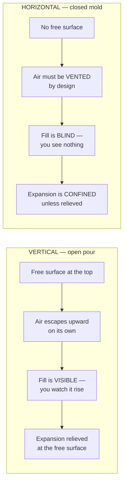
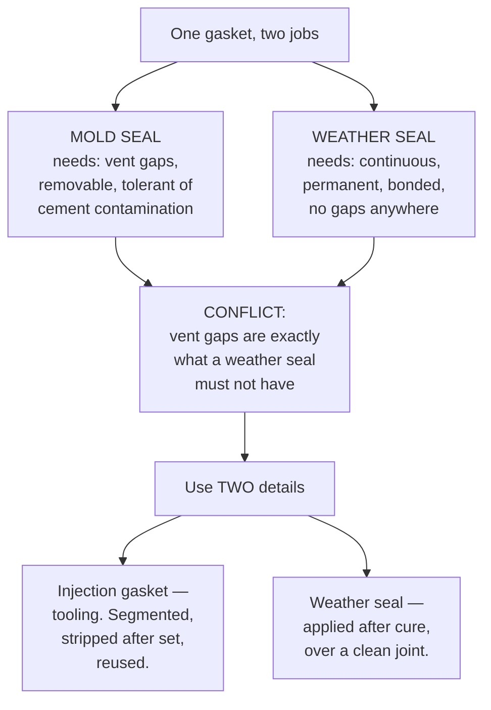
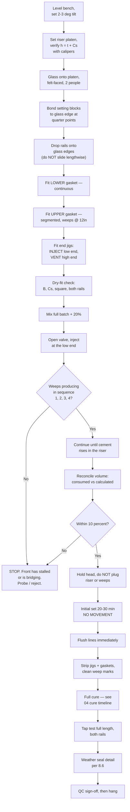

# 08 — Horizontal Injection Method

An alternative to the vertical open pour in [04](04-glazing-procedure.md): the
glass lies flat, the rail is fitted onto the edge horizontally, the ends are
closed with machined aluminum square-locator/dam jigs, the channel lips are
gasketed, and Por-Rok is injected through a port in the end jig.

**Verdict: this is a better method than the vertical open pour, and it is worth
building the tooling for.** But it changes the physics of the operation, and
four things must be designed in or it will produce panels with voids you cannot
see.

---

## 8.1 What the change actually is



Everything good about the horizontal method comes from the glass being fully
supported and the geometry being jig-controlled. Everything risky about it comes
from the cavity being closed.

### What you gain

| Gain | Why it matters |
|---|---|
| Glass never stands on edge | A 1/2" tempered lite standing vertically in a rail is the single most dangerous moment in the vertical method. This removes it. |
| Panel cures dead flat | No twist, no bow. Panel runs true in the track. |
| Rail cannot float on the cement | In the vertical pour the rail rides up on fluid cement and the bite grows. Here the rail sits on the bench and gravity holds it. |
| Both rails can be done in one setup | Half the handling. |
| Geometry is repeatable, not operator-dependent | The aluminum jig sets bite and square every time, identically. |
| Bench-height working, no overhead reach | Better ergonomics, better inspection. |

### What you must design around

| Risk | Consequence if ignored |
|---|---|
| Air trapped in the **upper** side gap | A continuous void along the top of the rail, invisible, directly in the load path |
| Blind fill — no visual confirmation | You cannot tell a good panel from a bad one |
| Confined expansion in a sealed rigid mold | 0.15% expansion with nowhere to go → pressure on the glass |
| Caulk-tube volume vs. cavity volume vs. 20–30 min set | Running dry mid-fill = cold joint through the structural bed |

---

## 8.2 The geometry, laid flat

Rotating the rail 90° does something important: **the two side gaps `Cs` are no
longer symmetric in behaviour.** One is now the top and one is the bottom.
Cement fills the bottom by gravity; air collects in the top.

### Diagram 8.1 — Master section, horizontal orientation

```
   ◄──────────── glass, lying flat ───────────►│◄──────── B (bite) ────────►│
                                               │                            │
                              ┌────────────────┴────────────────────────────┴──┐
                              │ ██████████████████████████████████████████████ │  ▲   t
                              ├────────────────────────────────────────────────┤  │
      ~~~~~~~~~~~~~~~~~~~~~~~ │ ░░░░░░░░░░░░ AIR PATH — MUST VENT ░░░░░░░░░░░░ │  │  Cs
      gasket ────►  ███████   ├────────────────────────────────────────────────┤  │
   ═══════════════════════════╪════════════════════════════════╗┊             │  │
              GLASS   Tg      │                                ║┊  Sb         │  │  Wr
   ═══════════════════════════╪════════════════════════════════╝┊             │  │
      gasket ────►  ███████   ├────────────────────────────────────────────────┤  │
      ~~~~~~~~~~~~~~~~~~~~~~~ │ ▓▓▓▓▓▓▓▓▓▓▓ POR-ROK — FILLS FIRST ▓▓▓▓▓▓▓▓▓▓▓▓ │  │  Cs
                              ├────────────────────────────────────────────────┤  │
    ┌─────────────────────────┤ ██████████████████████████████████████████████ │  ▼   t
    │  RISER PLATEN           └────────────────────────────────────────────────┘
    │  height h = t + Cs
    │  (felt-faced)
    └────────────────────────────────────────────────────────────────────────────
    ══════════════════════════════════════════════════════════════════════════════
                                  BENCH DECK
```

### The riser platen — the best part of this method

This is the piece of tooling that makes the horizontal approach genuinely
superior. Support the glass on a platen of height:

```
                    h  =  t  +  Cs

    where   t  = rail wall thickness
            Cs = (Wc − Tg) / 2   = the side gap you want

    Worked example (VERIFY against your rail):
            Wr = 1.750"   rail height
            t  = 0.125"   wall
            Wc = 1.500"   internal channel
            Tg = 0.500"   glass
            Cs = (1.500 − 0.500) / 2 = 0.500"
            h  = 0.125 + 0.500 = 0.625"
```

With the rail resting on the bench and the glass resting on a platen of height
`h`, **the glass self-centres in the channel along its entire length, by
gravity, with no clamping and no spacers.** In the vertical method, keeping `Cs`
equal is the hardest thing to hold; here it becomes automatic and impossible to
get wrong.

Make the platen from MDF, faced with felt, in one continuous piece, and check
its thickness with a caliper — an error in `h` is an error in `Cs` on every
panel you build.

### Diagram 8.2 — Riser platen, and what happens if you skip it

```
    WITH PLATEN (correct)                 WITHOUT PLATEN (glass sags to the
                                          bottom of the channel)
    ┌───────────────────┐                 ┌───────────────────┐
    │███████████████████│                 │███████████████████│
    ├───────────────────┤                 ├───────────────────┤
    │░░░░░░░ Cs ░░░░░░░░│                 │░░░░░░░░░░░░░░░░░░░│
    ├───────────────────┤                 │░░░░░ 2 × Cs ░░░░░░│
   ═╪═══════════════════│                 │░░░░░░░░░░░░░░░░░░░│
    │      GLASS        │                ═╪═══════════════════│
   ═╪═══════════════════│                 │      GLASS        │
    ├───────────────────┤                ═╪═══════════════════│
    │▓▓▓▓▓▓▓ Cs ▓▓▓▓▓▓▓▓│                 ├───────────────────┤
    ├───────────────────┤                 │███████████████████│
    │███████████████████│                 └───────────────────┘
    └───────────────────┘                  ▲
                                           GLASS ON BARE METAL.
    Cs equal, by gravity,                  Point contact, full length.
    full length, every panel.              Failure mode D-7 #4.
```

---

## 8.3 The air problem — and the fix

A sealed cavity injected from one end has nowhere to put the air ahead of the
advancing front. It will compress it, then stall, then you will stop injecting
because the gun got hard, and you will have a panel that is 70% full with the
void in the upper gap where it does the most harm.

### Diagram 8.3 — What happens with sealed lips and one injection port

```
    WRONG — fully sealed gaskets, inject one end, no vent

    inject
      │
      ▼
    ┌─┬────────────────────────────────────────────────────────────┬─┐
    │J│░░░░░░░░░░░░░░░░░░░░ AIR, COMPRESSING ░░░░░░░░░░░░░░░░░░░░░░│J│
    │I│════════════════════ GLASS ══════════════════════════════════│I│
    │G│▓▓▓▓▓▓▓▓▓▓▓▓▓▓▓▓▓─────►  front stalls here                  │G│
    └─┴────────────────────────────────────────────────────────────┴─┘
                                  ▲
              Pressure builds, gasket extrudes or blows out,
              cement backs up the injection line, and the
              upper gap NEVER fills.


    RIGHT — vented upper gasket + riser at the far end

    inject                    weep  weep  weep  weep         riser/vent
      │                         ▲     ▲     ▲     ▲              ▲
      ▼                         │     │     │     │              │
    ┌─┬─────────────────────────┴─────┴─────┴─────┴──────────────┼─┐
    │J│▓▓▓▓▓▓▓▓▓▓▓▓▓▓▓▓▓▓▓▓▓▓▓▓▓▓▓▓▓▓▓▓▓▓▓▓▓▓▓▓▓▓▓▓▓▓▓▓▓▓▓▓▓▓▓▓▓▓│J│
    │I│═══════════════════════ GLASS ═════════════════════════════│I│
    │G│▓▓▓▓▓▓▓▓▓▓▓▓▓▓▓▓▓▓▓▓▓▓▓▓▓▓▓▓▓▓▓▓▓▓▓▓▓▓▓▓▓▓▓▓▓▓▓▓▓▓▓▓▓▓▓▓▓▓│G│
    └─┴──────────────────────────────────────────────────────────┴─┘

              Air walks out ahead of the front, through the
              weeps and out the riser. Cement appearing at
              each weep in sequence tells you where the
              front is.
```

### The weep gaps are the answer to the blind-fill problem

Break the **upper** gasket into segments with a ~1/4" gap every 12". Each gap
does three jobs at once:

1. **Vents air** ahead of the advancing front.
2. **Tells you where the front is** — cement weeping out of gap 1, then 2, then
   3, in order, is direct visual confirmation that the fill is progressing and
   continuous. This restores the single biggest thing you lose by closing the
   mold.
3. **Relieves expansion** during set (see §8.5).

```
    UPPER GASKET — segmented (looking down on the rail lip)

    ┌────────────────────────────────────────────────────────────────┐
    │ ██████████████ ┊ ██████████████ ┊ ██████████████ ┊ ███████████ │
    │                ▲                ▲                ▲             │
    │              weep             weep             weep            │
    │              1/4"             1/4"             1/4"            │
    │           │◄──── 12" ────►│◄──── 12" ────►│                    │
    └────────────────────────────────────────────────────────────────┘

    LOWER GASKET — continuous, no gaps.  Nothing needs to vent
    downward, and a gap here just leaks.
```

### Tilt the bench

Raise the injection end by 2–3°. Air migrates uphill to the riser instead of
lodging at random high spots. Costs nothing — shim the legs.

```
                                                        riser
                                                          ║
                                                     ╔════╝
    inject                                          ╱
      ║                                            ╱
      ╚═══════════════════════════════════════════╱     2-3° tilt
      ╱─────────────────────────────────────────╱
     ╱   air ────────────────────────────────►
    ═══════════════════════════════════════════
      LOW END                            HIGH END
     (inject here)                      (vent here)
```

---

## 8.4 The caulk tube — do the volume arithmetic first

This is where the plan is most likely to fail on the day. Compute the cavity
volume before you commit to a delivery method.

```
    CAVITY VOLUME PER RAIL

    V  ≈  L × Cs × B × 2        the two side gaps
        + L × Wc × Sb           the bed beyond the glass edge

    Worked example — 42" wide panel, Cs = 0.500", B = 3", Wc = 1.5", Sb = 0.25"

    V  ≈  42 × 0.500 × 3 × 2  =  126.0 in³
        + 42 × 1.5 × 0.25     =   15.8 in³
                              = ~142 in³   per rail
                              = ~284 in³   for both rails
```

Now compare against what a caulking gun actually delivers:

| Delivery | Capacity | Loads per 142 in³ rail | Verdict |
|---|---|---|---|
| Standard 10.1 oz tube | 18.2 in³ | **8** | Unworkable |
| 20 oz bulk/sausage gun | 36.1 in³ | **4** | Marginal |
| 29 oz bulk gun | 52.3 in³ | **3** | Marginal |
| Gravity head tank | Unlimited | **0 reloads** | Recommended |
| Grout / wet-glaze pump | Continuous | **0 reloads** | Recommended |

Every reload is a pause. Every pause in a cement that sets in 20–30 minutes is a
**cold joint** — a plane of weakness straight through the structural bed, in the
one rail that carries the whole panel.

There is a second problem with the caulk gun: Por-Rok mixed to the flowable
consistency the data sheet calls for (16 oz water per 5 lb) is a thin slurry,
not a paste. Caulking guns are built for high-viscosity paste. A slurry drools
out of the nozzle under its own weight and backflows past the plunger. Do not
solve this by thickening the mix — flowability is exactly what a blind fill
depends on.

### Diagram 8.4 — Recommended: gravity head feed

```
                              ┌─────────────┐
                              │   HOPPER    │  keep topped up; the crew's
                              │  ▓▓▓▓▓▓▓▓▓  │  only job is to keep this full
                              │  ▓▓▓▓▓▓▓▓▓  │
                              └──────┬──────┘
                                     │
                                  ┌──┴──┐
                                  │VALVE│  ball valve — lets you stop
                                  └──┬──┘  without losing the head
                                     │            ▲
                              ┌──────┴──────┐     │
                              │             │     │  H = 24"–36"
                              │  1" ID hose │     │
                              │             │     │
                              └──────┬──────┘     ▼
    ┌─────────────────────────────┬──┴──┬──────────────────────────────┐
    │                             │ JIG │                              │
    │  ▓▓▓▓▓▓▓▓▓▓▓▓▓▓▓▓▓▓▓▓▓▓▓▓▓▓─┴─────┴─►                            │
    └───────────────────────────────────────────────────────────────────┘

    Head pressure at the port, H = 30", slurry SG ≈ 2.0:
         p  =  30" × 0.036 psi/in × 2.0  ≈  2.2 psi

    LOW, CONSTANT, SELF-LIMITING.
      - Will not blow the lip gaskets out (a caulk gun makes 20-60 psi)
      - Never runs dry mid-fill
      - Keeps feeding as the cement settles and self-levels
      - Nothing to prime, nothing to jam
```

If you want faster fill than gravity gives, use a purpose-built wet-glaze pump
(CRL sells one specifically for pushing expansion cement into base shoes) rather
than a caulk gun. Whatever you use, **flush the line with water the moment the
pour is done** — Por-Rok sets in 20–30 minutes and will set solid inside a hose.

---

## 8.5 Do not seal the mold during set

Por-Rok is a **controlled expansion** cement — 0.15% per ASTM C157. In the
vertical open pour, that expansion is taken up at the free surface. In a fully
sealed rigid aluminum mold there is no free surface, and the only compliant
thing in the assembly is the glass.

```
    CONFINED EXPANSION — what a fully sealed mold does

    ┌──────────────────────────────────────┐
    │██████████████████████████████████████│  rigid aluminum
    ├──────────────────────────────────────┤
    │▓▓▓▓▓▓▓▓▓ expanding 0.15% ▓▓▓▓▓▓▓▓▓▓▓▓│
    │▓▓▓▓▓▓▓▓▓▓▓▓▓▓ ──────► ◄────── ▓▓▓▓▓▓│
   ═╪══════════════════════════════════════│  ← the glass is the only thing
    │            GLASS                     │    in the assembly that can yield
   ═╪══════════════════════════════════════│
    │▓▓▓▓▓▓▓▓▓▓▓▓▓▓ ──────► ◄────── ▓▓▓▓▓▓│
    ├──────────────────────────────────────┤
    │██████████████████████████████████████│
    └──────────────────────────────────────┘

    RULE: leave the riser and the weeps OPEN through initial set.
          Plug nothing until the cement has gone off.
          The riser column is your expansion relief.
```

This alone is a reason not to make the lip gaskets a continuous airtight seal.

---

## 8.6 The gasket: separate the two jobs you are asking it to do

You proposed one rubber strip that (a) seals the mold during injection and
(b) permanently replaces the silicone cap bead. Those are two different parts
with incompatible requirements.



### On replacing silicone permanently

A permanent gasket at the rail lip is a legitimate detail — it is what CRL base
shoes use, where the wet-glaze grout is specified to "extend to the roll-in
rubber glazing channel in the base shoe." But note *roll-in*: the industry
detail is a wedge gasket rolled into a **machined groove in the extrusion**, not
a strip laid on the lip. A surface-laid strip has nothing holding it, will
extrude under injection pressure, will creep out over time, and will telegraph
as a dirt line.

So:

- **If the TX9500 rail has a roll-in gasket groove** — [VERIFY] from the
  extrusion drawing — then a permanent roll-in gasket is a proper detail and you
  can consider it as the primary seal.
- **If it does not**, use the gasket as removable tooling only, and cap-bead
  with neutral-cure silicone after cure as in [04](04-glazing-procedure.md).

And regardless of which you choose: on an **exterior** panel, do not let the
seal choice become the reason a gypsum-based cement is considered acceptable.
That reasoning is backwards, and it is the point made in
[D-6](05-diagram-pack.md#d-6--water-management-on-an-exterior-panel) — a seal is
a 10–20 year consumable, the cement bed is meant to be permanent, and you should
never make a permanent element depend on a consumable one. The cement selection
in [02](02-material-selection.md) is unchanged by going horizontal.

---

## 8.7 The end jig

Aluminum is a good call — machinable, stiff, reusable, and you can build the
ports into it.

### Diagram 8.5 — End jig, elevation looking at the rail end

```
        ┌───────────────────────────────────────────────┐
        │  ○                                         ○  │  ← clamp bolts to
        │        ╔═══════════════════════════╗          │    rail end, or
        │        ║                           ║          │    toggle clamps
        │   ┌────╢    VENT / RISER PORT      ║          │
        │   │    ║    (upper — always the    ║          │
        │   │    ║     high side)            ║          │
        │   │    ╚═══════════════════════════╝          │
        │   │  ┌─────────────────────────────────────┐  │
        │   │  │░░░░░░░░░░░ upper Cs ░░░░░░░░░░░░░░░│  │
        │   │  ├─────────────────────────────────────┤  │
        │   │  │▒▒▒▒▒▒▒ GLASS SLOT ▒▒▒▒▒▒▒▒▒▒▒▒▒▒▒▒▒│  │  ← slot = Tg + 1/32"
        │   │  ├─────────────────────────────────────┤  │    THIS is what
        │   │  │▓▓▓▓▓▓▓▓▓▓▓ lower Cs ▓▓▓▓▓▓▓▓▓▓▓▓▓▓▓│  │    locates the glass
        │   │  └─────────────────────────────────────┘  │
        │   │    ╔═══════════════════════════╗          │
        │   └────╢    INJECTION PORT         ║          │
        │        ║    (lower — always the    ║          │
        │        ║     low side)             ║          │
        │        ╚═══════════════════════════╝          │
        │  ○                                         ○  │
        └───────────────────────────────────────────────┘

        INJECT LOW.  VENT HIGH.  Never the other way round —
        injecting high means cement falls past the air and
        seals it in.
```

### Diagram 8.6 — End jig, plan section (the square-locator function)

```
                             │◄──── B ────►│
                             │             │
    ┌────────────────────────┴─────────────┴───────┐
    │                                              │
    │   ═══════════════════════╗                   │
    │        GLASS             ║ ← BITE STOP:      │
    │   ═══════════════════════╝   a machined      │
    │                              shoulder the    │
    │                              glass edge      │
    │                              butts against   │
    │        ▲                                     │
    │        │  glass slot, Tg + 1/32"             │
    │        │  faced with UHMW so the jig never   │
    │        │  touches bare glass edge-on         │
    │                                              │
    │   ┌────────────────────────────────────┐     │
    │   │  RAIL END REGISTER — pocket cut to  │     │  ← this is what holds
    │   │  the rail's outside profile         │     │    the rail SQUARE
    │   └────────────────────────────────────┘     │
    │                                              │
    └──────────────────────────────────────────────┘

    The jig sets, in one part:
        - bite B                    (bite stop shoulder)
        - Cs upper / Cs lower       (glass slot position — but the
                                     riser platen is what holds it
                                     over the full length)
        - square, both axes         (rail end register pocket)
        - end dam                   (closed face)
        - end cap setback d         (pocket depth)  [VERIFY]
```

**Jig build notes**

- Face every surface the cement touches with packing tape, or spray with release
  agent. Cured Por-Rok on bare aluminum is a chisel job, and you want this jig
  for the next hundred panels.
- Perimeter gasket (closed-cell foam or O-ring cord in a groove) where the jig
  meets the rail end — cement finds every gap.
- Set the pocket depth back by the end cap depth `d` plus 1/8", or the end caps
  will not seat.
- Make them in **handed pairs** and stamp them. An injection jig fitted at the
  vent end will ruin a panel.

---

## 8.8 Revised process flow



---

## 8.9 QC for a blind fill

You lose visual fill confirmation. Replace it with three independent checks —
**all three**, not one of them.

### 1. Weep sequence (during fill)

Cement must appear at each weep **in order**, from the injection end to the vent
end. Out-of-order or skipped weeps mean the front has split around a bridge.

```
    ✔ GOOD                          ✘ BAD
    weep: 1  2  3  4  5             weep: 1  2  ·  4  5
    time: 10 22 35 47 60 s          time: 10 22 -- 31 44 s
                                              ▲
    Monotonic, roughly even         Weep 3 dry, and 4 came too
    spacing. Front is a             early → the front split and
    single advancing plane.         rejoined around a void.
```

### 2. Volume reconciliation (immediately after fill)

The single most valuable check available for a closed mold, and it costs
nothing.

```
    Calculated cavity volume        V_calc  = _________ in³
    Cement actually consumed        V_used  = _________ in³
       (weigh the hopper before and after; divide by
        the mixed slurry density you measured)

    Fill fraction  =  V_used / V_calc

        ≥ 0.95        ✔  accept, pending tap test
        0.85 – 0.95   ⚠  investigate — probe the weeps
        < 0.85        ✘  REJECT. You have a void of
                          15%+ of the structural bed.
```

Measure your slurry density once, on a known-volume container, and write it on
the wall. You will use it on every panel.

### 3. Tap test (after cure)

Per [06 §6.3](06-qc-and-troubleshooting.md#the-tap-test), every 4", full length,
both rails. A hollow section at or near a hanger position is a reject, not a
repair.

---

## 8.10 Summary of changes to the base procedure

| Element | Vertical method ([04](04-glazing-procedure.md)) | Horizontal injection |
|---|---|---|
| Glass orientation | On edge, vertical | Flat on riser platen |
| `Cs` control | Squaring jig + operator care | Riser platen, `h = t + Cs`, automatic |
| Bite `B` control | Setting blocks + bite gauge | End jig bite stop |
| Squareness | Squaring jig, checked 3× | End jig register pocket |
| Cement entry | Pour ramp, one side, from above | Injected at the low end |
| Air management | Escapes upward at the free surface | **Segmented upper gasket + riser** |
| Fill confirmation | Visual — watch it rise | **Weep sequence + volume reconciliation** |
| Expansion relief | Free surface | **Open riser + weeps through set** |
| Delivery | Bucket + ramp | **Gravity head tank or grout pump — not a caulk gun** |
| Weather seal | Silicone cap bead | Gasket and/or cap bead, per §8.6 |
| Cement selection | [02](02-material-selection.md) | **Unchanged** — going horizontal does not make gypsum-based Por-Rok acceptable on an exterior door |

---

## 8.11 Additional verification items

Add these to [07](07-verification-checklist.md):

| # | Item | Status |
|---|---|---|
| A9 | Rail wall thickness `t` — needed for riser platen height `h` | ☐ |
| A10 | Does the extrusion have a roll-in gasket groove at the lip? Determines whether a permanent gasket is a legitimate detail or improvisation | ☐ |
| B9 | Measured density of mixed Por-Rok slurry, for volume reconciliation | ☐ |
| B10 | Does TORMAX permit injection glazing, or only the method in their manual? | ☐ |

---

## Sources

- [CRL — Wet Glaze Pump and Accessories](https://www.crlaurence.com/All-Products/Railing-Systems-&-Windscreens/Glass-Railing-Systems-&-Components/Glass-Railing-Installation-Tools-&-Accessories/CRL-Wet-Glaze-Pump-and-Accessories/p/GRP1) — purpose-built pump for expansion cement into base shoes
- [ICC-ES ESR-3269 (PDF)](https://azure.crlaurence.com/datasheets/pdfs/ESR-3269.pdf) — grout must be continuous, filling all voids, and extend to the roll-in rubber glazing channel
- [Por-Rok Technical Datasheet (PDF)](https://specchem.com/wp-content/uploads/2023/03/Por-Rok-Tech-Sheet.pdf) — flowable mix ratio, 20–30 min set, 0.15% expansion per ASTM C157
- [FHC — Traditional Wet Glaze Railing System](https://fhc-usa.com/railing-hardware/traditional-glass-railing-system.html) — roll-in gasket detail
